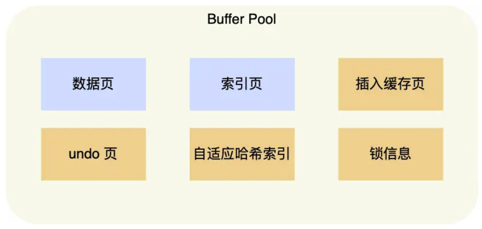

# Buffer Pool
## 整体结构图

* 当读取数据时，如果数据在Buffer Pool中存在，那么客户端直接从Buffer Pool中读取，否则从磁盘中读取，并将读取的页存入Buffer Pool
* 当修改数据时，也是先修改Buffer Pool中的数据，将对应的页设置为脏页，由后台线程将脏页刷到磁盘中

Buffer Pool在MySQL启动时，向操作系统申请一片连续的内存空间。默认配置为128M 可通过innodb_buffer_pool_size参数来设置Buffer Pool的大小。

## Buffer Pool 存储内容
InnoDB讲存储的数据划分为若干个页，以页作为磁盘(磁盘每个扇区为512B)和内存交互的基本单位，一个页的默认大小为16KB。
MySQ刚启动时，已使用的虚拟内存空间很大，但实际使用的物理空间却很小，只有在这些虚拟内存被访问后，操作系统产生缺页中断，建立映射关系
Buffer Pool除了缓存索引页和数据页。还包括了undo页， 插入缓存，自适应hash索引，锁信息等

## Buffer Pool如何组织数据
