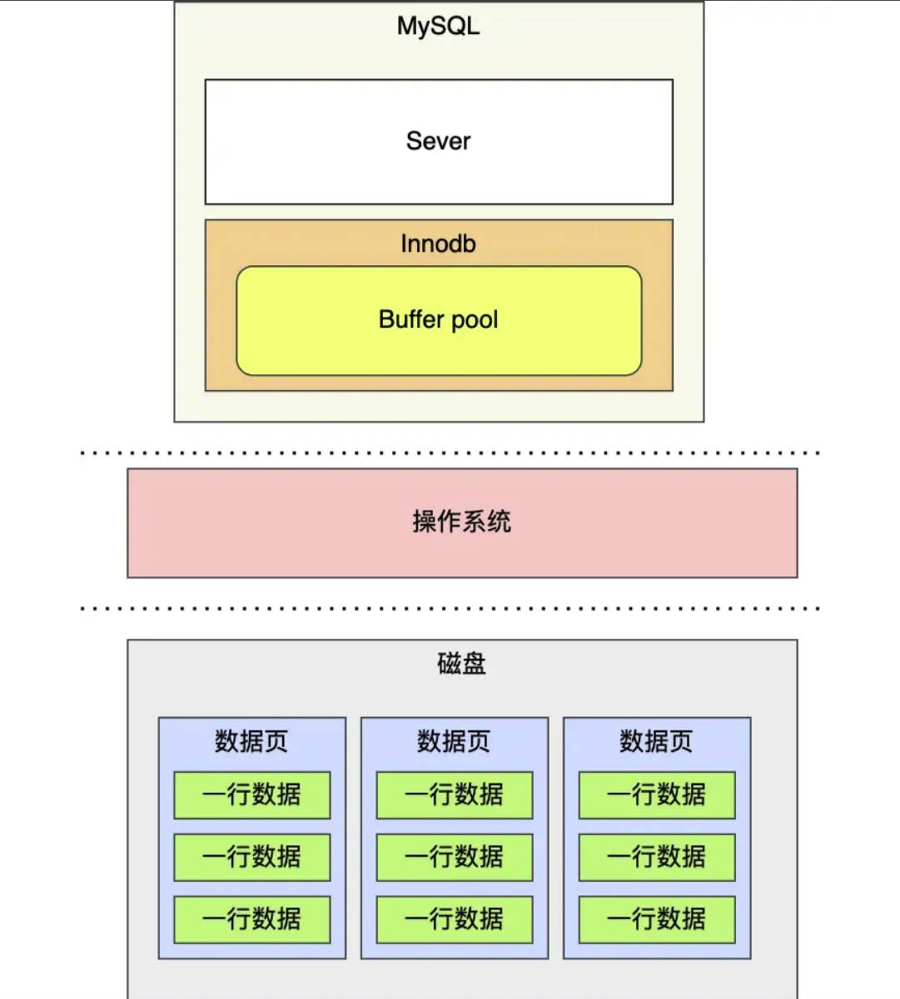
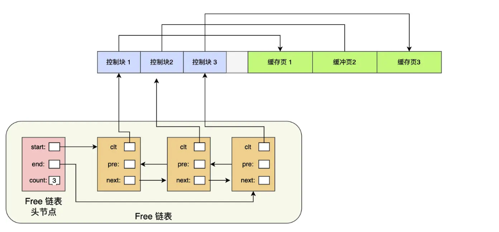

# Buffer Pool
## 整体结构图

* 当读取数据时，如果数据在Buffer Pool中存在，那么客户端直接从Buffer Pool中读取，否则从磁盘中读取，并将读取的页存入Buffer Pool
* 当修改数据时，也是先修改Buffer Pool中的数据，将对应的页设置为脏页，由后台线程将脏页刷到磁盘中

Buffer Pool在MySQL启动时，向操作系统申请一片连续的内存空间。默认配置为128M 可通过innodb_buffer_pool_size参数来设置Buffer Pool的大小。

## Buffer Pool 存储内容
InnoDB讲存储的数据划分为若干个页，以页作为磁盘(磁盘每个扇区为512B)和内存交互的基本单位，一个页的默认大小为16KB。
MySQ刚启动时，已使用的虚拟内存空间很大，但实际使用的物理空间却很小，只有在这些虚拟内存被访问后，操作系统产生缺页中断，建立映射关系
Buffer Pool除了缓存索引页和数据页。还包括了undo页， 插入缓存，自适应hash索引，锁信息等

## Buffer Pool如何组织数据
InnoDB会为每个缓存页都创建一个控制块，控制块信息包括「缓存页的表空间，页号，缓存地址，链表节点」等。
控制块页是占有内存空间，它们被放在Buffer Pool的最前面，接着才是缓存页

### 如何管理空闲页
为了能快速找到空闲页，Buffer Pool使用链表，将空闲页的控制块作为链表的节点串联起来，称为**Free链表**

### 如何管理脏数据
根Free链表类似，也是用链表将所有脏页都串联为一个链表，称为**Flush链表**

Free 和Flush都有一个链表头的，记录这链表元素个数以及头节点和尾节点的地址

### 如何提高命中率
MySql使用改进后的LRU算法来提高命中率，改进后的LRU解决以下问题：
1. 预读失效
2. Buffer Pool 污染

#### 预读失效
预读失效是指，MySQL为提高命中率，将后续可能被访问的数据读入内存，但最终这些数据没有被访问的现象被称为预读失效。在传统的LRU算法中，如果短时间这种行为过多，就会将热点数据从内存中淘汰造成缓存命中率降低，影响性能

**解决方法**：
将LRU链表分为old区和young区。预读页只需要加入old区的头部，只有在被真正访问时，才被插入到young区的头部

#### Buffer Pool污染
如果SQL语句进行了大量数据扫描(每条数据都被访问了一次)，此时即便分为young区和old区也无法阻止大量热点数据被淘汰，这就称为Buffer Pool污染。

**解决方法**
进入young区域条件增加一个停留在old区域时间的判断
* 如果后续的访问时间与第一次的访问时间在某个时间间隔之内，则不会从old区移动到young区。
* 如果两次访问时间间隔超过某个时间间隔，那么就将该缓存页移动到young区头部。

## 脏页什么时候刷盘
InnoDB的更新操作采用Write Ahead Log策略。先写日志，再写入磁盘，通过redo log 日志让MySQL拥有崩溃恢复的能力

**以下几种情况会触发脏页的刷新**
1. 当redo log日志满了的情况下，会主动触发脏页刷新到磁盘
2. Buffer Pool 空间不足时，需要淘汰一部分数据页，如果淘汰的是脏数据页，则需要将脏数据刷到磁盘
3. MySQL 认为空闲时，后台线程会定期刷脏页
4. MySQL正常关闭前