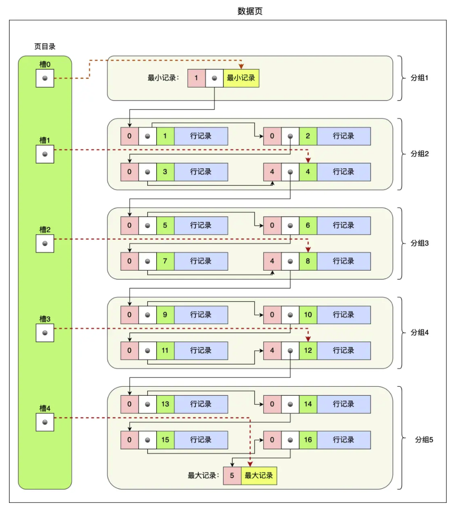
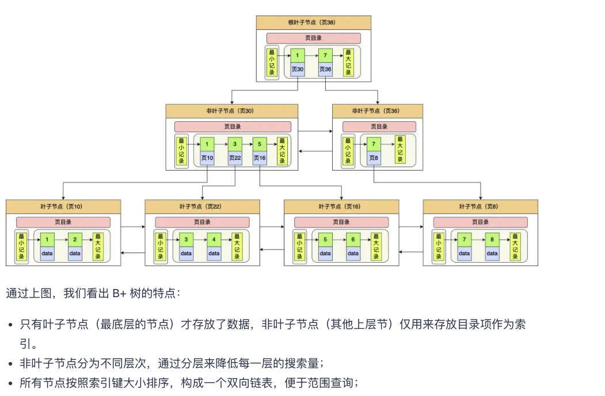
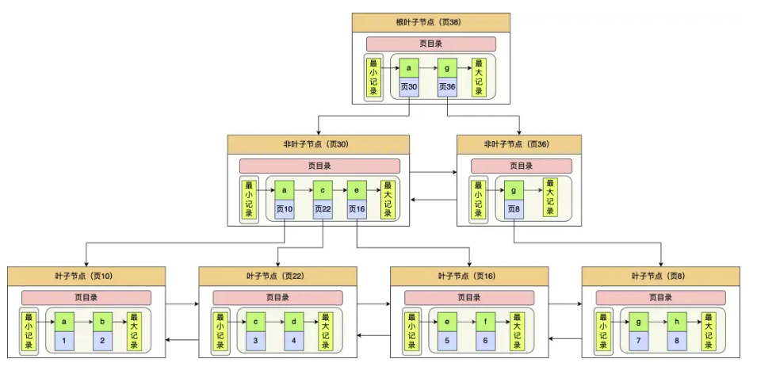
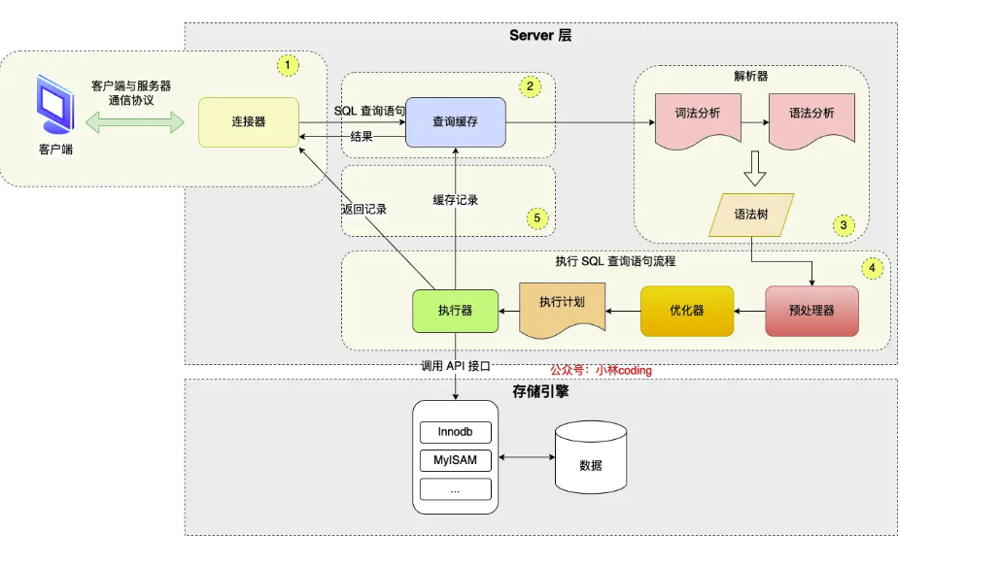

## InnoDB如何存储数据
InnoDB是按数据页为单位来读取数据的。InnoDB数据页的默认大小是16KB。因此意味着一次最少充磁盘读取16K的内容到内存。一次最少包16K的内存内容刷新到磁盘。

数据页之间使用双向链表将数据页链接起来。
数据页中的记录则是按照主键顺序组成单向链表(一个数据页游16K的数据，意味着有很多数据，单向链表检索速率将非常低，如何解决？)

---
为了加快在数据页中的检索。InnoDB在数据页中维护了一个页目录，并且将该数据页中的数据进行了逻辑分组

* 页目录中的每个槽指向对应分组的最后一个项
* 每个分组中的最后一个元素记录着该分组中有多少个元素

因此当要寻找某一项时，对页目录使用二分查找法，就能确认目标项在哪一个分组中。又因为是单向链表且槽指向的是分组中的最后一个元素，因此需要从上一个槽开始向下寻找。
InnoDB对每个分组记录条数的规定：
1. 第一个分组中的记录只有1条
2. 最后一个分组中的记录条数在1~8条之间
3. 剩下的分组中记录的条数范围在4~8条之间。

## B+树是如何进行查询的
InnoDB采用B+树作为索引。每一个数据页作为B+树的一个节点。并且B+树的结构趋于扁平，数据都在叶子节点。因此需要进行的IO次数较少。且每个节点都是使用双向链表链接，且数据是有序排列的。因此在进行范围查询时更快。

## 聚簇索引和二级索引
索引可以分为聚簇索引和非聚簇索引(二级索引)。
* 聚簇索引的叶子节点存放的是实际数据，所有完整的用户记录都存放在聚簇索引的叶子节点
* 二级索引的叶子节点存放的是主键值，而非实际数据
因为表的数据都是放在聚簇索引的叶子节点里，所以InnoDB引擎一定会为表创建一个聚簇索引，由于数据在物理上只会保存一份，所以聚簇索引只能有一个
聚簇索引的选择：
* 如果有主见，默认会选择主见作为聚簇索引的索引键
* 如果没有主键，则会选择第一个不包含NULL值的唯一列作为聚簇索引的索引键
* 如果上面两个都没有的情况下，InnoDB会自动生成一个隐式自增的ID列作为聚簇索引的索引键
---
由于聚簇索引只有一个，当需要对非主键进行快速查找时，就需要二级索引。二级索引的叶子节点存放额是主键的值

因此，如果某个查询语句使用了二级索引，但查询的数据不是主见，此时在二级索引找到主键之后，需要去聚簇索引中获取真正的数据，这个过程叫做回表。也就是说通过二级索引查找数据需要对两个B+树进行查找。当查询的数据是主键时，在二级索引中就能查询到，不用再去聚簇索引查找，这个过程叫做索引覆盖。

## 为什么采用B+树作为索引

从上图可以看出，索引和数据是保存在磁盘中的。因此磁盘IO是数据库性能的瓶颈，建立索引考虑的则是尽可能减少IO次数，以提高吞吐率。同时还要很好的支持数据库的范查找。
