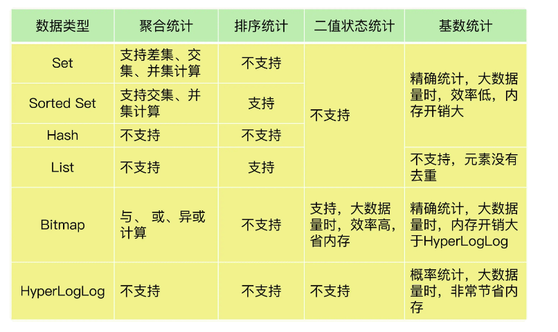

## 场景：
1. 在移动应用中，统计每天的新增用户数和第二天的留存用户数
2. 在电商网站的商品评论中，统计品论列表的最新评论
3. 在签到打卡中，统计一个月内连续打卡的用户数
4. 在网页的访问记录中，统计独立访客量
### 聚合统计
聚合统计(交并补)采用集合来存储。当数据量过大时，由于计算复杂度较高易造成redis主线程阻塞。因此可以<font color=red>从集群中选择一个从库，让他专门负责聚合计算，或者把数据读到客户端，在客户端来完成聚合统计(如果读到客户端，涉及大数据的网络传输)</font> 如何指定一个从库做聚合计算，怎么把计算结果发给客户端？
**聚合统计命令**：
```redis
并集：
SUNIONSTORE destination key [key ...]
补集：
SDIFFSTORE destination key [key ...]
交集：
SINTERSTORE destination key [key ...]
```
### 排序统计
在redis的集合类型中(List, Hash, Set, Sorted Set).List和Sorted Set属于有序集合
List按照元素进入List的顺序进行排序，而Sorted Set根据元素的权重来排序。
因此，在分页显示排序结果的过程中，如果有新元素插入进来。List结构就会在第二页显示出第一页已显示的项。而Sorted Set因为是权重排序，只要每个元素的权重不重复，就不会出现同一元素被取到两次的情况。

### 二值状态统计
二值状态统计适用于只有两种状态的统计(比如签到)。我们可以选择Redis的扩展类型**Bitmap**
**Bitmap**本身是用String类型作为底层数据结构实现的一种统计二值状态的数据类型。String类型会保存为二进制的字节数组。Redis就把字节数组的每个bit位利用起来。
**二值统计命令**
```
```
### 基数统计
HyperLogLog是一种用于统计基数的数据类型。它的优势在于，当集合元素数量非常多，计算基数所用空间总是固定的，而且很小。<font color=red>但它是基于概率的统计，因此在不要求精确统计，且内存有限的情况下可以选择这种数据结构</font>


### 疑问：
1. 为什么集合适合用于做聚合统计？