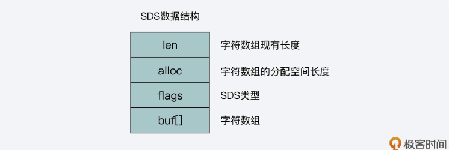
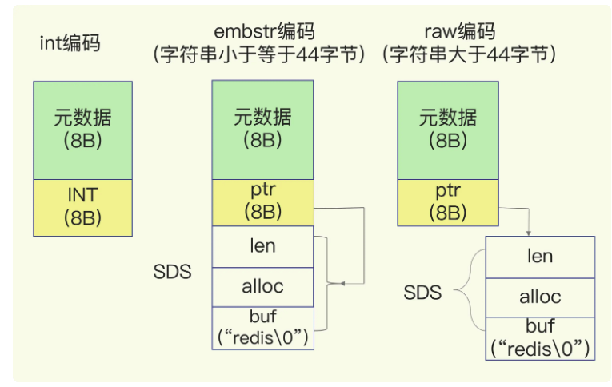
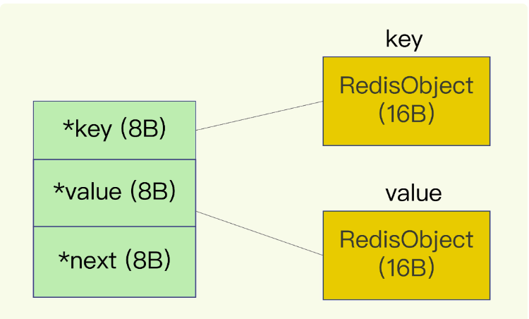

## 场景：开发一个图片系统，要求能快速记录图片ID和图片在存储系统中保存的id。同时还要能快速的通过图片id查找到图片的存储id。 图片数量巨大。

分析：一个图片id对应一个唯一的存储id。 是典型的单值键值对。由于图片量巨大，因此使用lang类型存储图片的两个id。
### 使用String类型来存储
使用String类型来存储，保存一亿张图，需要使用大约6.4G的内存，基本平均每个图片消耗了64字节的内存(但两个图片id消耗的内存最多16字节)随着图片数量的增加，内存使用还在上升。最终会因redis内存过大，在进行RDB时响应变慢。

#### 为什么string类型如此耗内存
由上述分析可看出，String类型的元数据对内存的消耗比较大。redis的String类型的数据结构如下

* buf[]中保存着真实的字符串数据。

* 当保存的数据是long类型整数时，RedisObject的指针就直接复制为整数数据，以节省开销
* 当保存的数据是字符串，但长度小于44字节时，RedisObject中的元数据，指针和sds时连在一块的，避免内存碎片的产生。这种编码被称为embstr编码
* 当字符串大于44字节时，则给sds独立分配空间，使用指针指向sds。这种布局称为raw编码模式。

由于redis会用一个全局的hash表保存所有的键值对。且String类型的键值对每个都是直接挂在全局链表上(而其他键值对，比如压缩列表则只会在全局链表上挂一个键值对，键为压缩列表的名称，值则是压缩列表，而压缩
列表中又包含多个键值对)。所以string类型在这里消耗的资源也比较大

***由此可见使用string来保存键值对都很小的对象会造成极大浪费***

### 使用压缩列表来存储
* 首先 压缩列表中，多个键值对才会消耗一个压缩列表的元数据
* 配置压缩列表阈值
    * hash-max-ziplist-entries：表示用压缩列表保存时哈希集合中的最大元素个数。
    * hash-max-ziplist-value：表示用压缩列表保存时哈希集合中单个元素的最大长度。
以此例为例。我们可以将图片的key 拆分。例如使用前7位表示此压缩列表名称，后3位表示该图片在此压缩列表中的key。(1亿张图中，前7位一定会有若干相同的，那么这些照片将会被归到同一个压缩列表中，而前7位相同的图片必定后3为不同。则同一压缩列表中的键值对个数不会超过1000个)。

缺点：如果有图片频繁的插入，则尽量不要选压缩列表。插入一个元素可能造成压缩列表的连环更新。如果频繁的插入，可以选择用双向链表保存。
