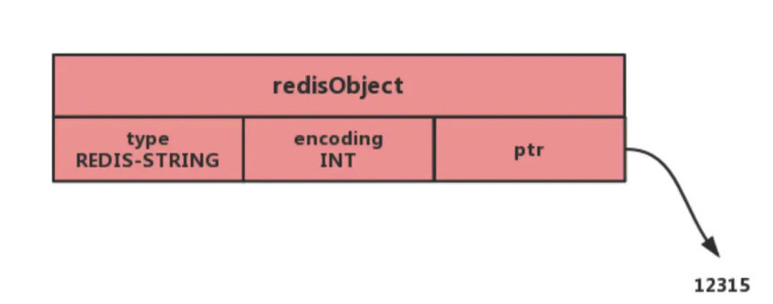
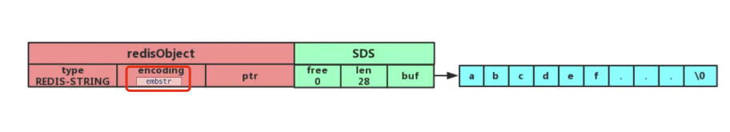
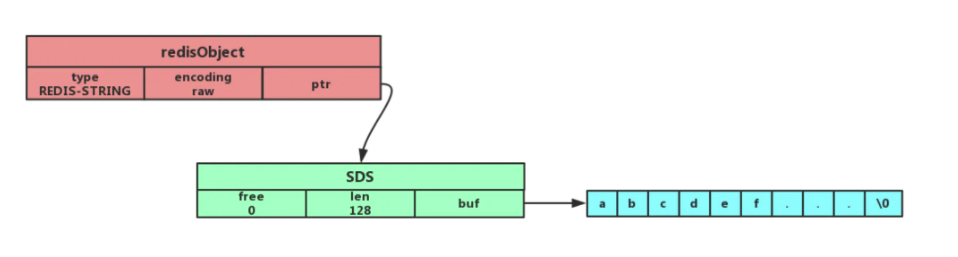
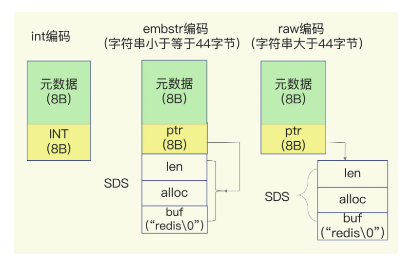
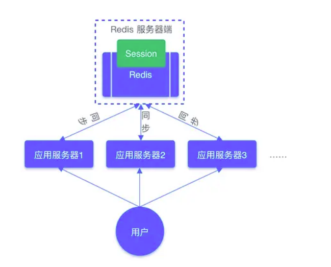

## 内部实现
字符串的内部编码有三种：int embstr和raw
* int：如果一个字符串对象是整数值，且这个值可以用long类型标识，那么字符串对象将会把该整数保存在ptr成员中，将encoding设置为INT

* embstr：当字符串小于44字节时，RedisObject中的原数据指针和sds是一块连续的内存区域，这样就避免了内存碎片的产生。

* raw：当字符串长度大于44字节时，SDS的数据量开始变多，redis不在把sds和redisObject布局在一起，而是给sds单独分配独立的空间，并使用指针指向sds结构。


<font color=red>注意：sds中的buf是字符串数组，其内存一块和sds紧挨着的连续的内存</font>
以sdshdr8为例：
```c
struct __attribute__ ((__packed__)) sdshdr8 {
    uint8_t len; /* 字符数组现有长度*/
    uint8_t alloc; /* 字符数组的已分配空间，不包括结构体和\0结束字符*/
    unsigned char flags; /* SDS类型*/
    char buf[]; /*字符数组*/
};
```


对embstr字符串进行修改时，redis会先讲起转换为raw，然后再执行修改命令。

## 应用场景：
1. 缓存对象
```
SET user:1 '{"name":"xiaolin", "age":18}'
```
2. 常规计数
```
SET aritcle:readcount:1001 0
INCR aritcle:readcount:1001
GET aritcle:readcount:1001
```
3. 分布式锁
```
SET lock_key unique_value NX PX 10000
```
4. 共享session信息
