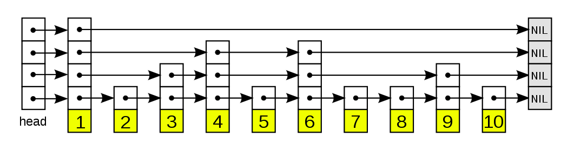
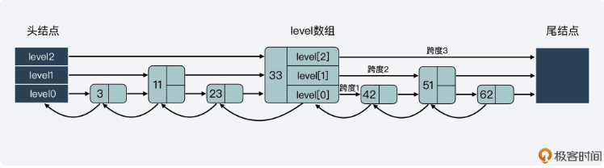

# 跳表
**经典跳表图概览**

**Redis跳表图概览**


经典跳表和Redis跳表的区别
1. 允许重复的score值，多个不同member的score值可以相同
2. 进行对比操作时，不仅要检查score值，还要检查member。
3. 每个节点都带有一个高度为1层的后退指针，用于从表尾方向想表头方向遍历。

## 核心数据结构
```C
typedef struct zskiplistNode {
    sds ele;
    double score;
    struct zskiplistNode *backward;
    struct zskiplistLevel {
        struct zskiplistNode *forward;
        unsigned long span; //从该节点到跳表末尾的跨度
    }level[];
}zskiplistNode;

typedef struct zskiplist {
    struct zskiplistNode *header, *tail;
    unsigned long length;
    int level;
}zskiplist;
```
## 相关函数
1. 创建一个跳表节点：zslCreateNode
```C
zskiplistNode *zdlCreateNode(int level, double score, sds ele) {
    zskiplistNode *zn = zmalloc(sizeof(*zn)+level*sizeof(struct zskiplistLevel));
    zn->score = score;
    zn->ele = ele;
    return zn;
}
```
2. 创建一个跳表：zslCreate
```C
zskiplist *zslCreate(void) {
    int j;
    zskiplist zsl;
    zsl = zmalloc(sizeof(*zsl));
    zsl->level = 1;
    zsl->length = 0;
    zsl->header = zslCreateNode(ZSKIPLIST_MAXLEVEL, 0 , NULL);
    for(j = 0; j < ZSKIPLIST_MAXLEVEL; j++) {
        zsl->header->level[j].forward = NULL;
        zsl->header->level[j].span = 0;
    }
    zsl->header->backward = NULL;
    zsl->tail = NULL;
    return zsl;
}
```
创建了跳表的头结点，且头结点的level层数为最高层32。
3. 在跳表中插入一个新元素：zslInsert
```C
# zslInsert()
zskiplistNode *zslInsert(zskiplist *zsl, double score, sds ele) {
    // update : 记录 在查询 插入结点位置 的过程的降层结点,包括最后找到的的level[0]层的结点
    // 即从最高层开始向下记录每层标记的插入位置结点,也可以说是记录降层结点
    zskiplistNode *update[ZSKIPLIST_MAXLEVEL], *x;
    // 记录每一层中 从最高层到当前层的降层结点的排位(rank)
    unsigned int rank[ZSKIPLIST_MAXLEVEL];
    int i, level;

    serverAssert(!isnan(score));
    
    
    # 查询 插入结点 的插入位置 start
    
    ## 查询过程会通过update来记录每一层的降层结点,rank来记录每一层的排位
    
    // 取到header
    x = zsl->header;
    1. // 从最高层开始往下遍历
    for (i = zsl->level-1; i >= 0; i--) {
        1.1 // 记录当前i层的排位,如果是最高层,则是0
        // 否则取上一层的排位
        rank[i] = i == (zsl->level-1) ? 0 : rank[i+1];
        1.2 // 多个条件判断是否同层前进还是降层
        // 如果i层结点的forward没有结点,那么当前必须降层,对应的1.3步骤,否则继续判断
        // 如果i层结点的forward结点的分值 小于 插入结点的分值 则同层前进(1.2.2步骤),否则继续判断
        // 如果i层结点的forward结点的分值 等于 插入结点的分值 并且 
        // i层结点的forward结点的ele字符串 小于 插入结点的ele字符串
        while (x->level[i].forward &&
                (x->level[i].forward->score < score ||
                    (x->level[i].forward->score == score &&
                    sdscmp(x->level[i].forward->ele,ele) < 0)))
        {
            1.2.1 // 叠加i层的排位
            rank[i] += x->level[i].span;
            1.2.2 // 同层移动
            x = x->level[i].forward;
        }
        1.3 // 降层,保存每层的插入位置节点,即保存降层结点
        update[i] = x;
    }
    
    # 查询 插入结点 的插入位置 end
    
    ## 开始插入结点 start
    
    2. // 随机计算层数
    level = zslRandomLevel();
    3. // 如果随机计算的层数大于当前的层数,需要做一些操作
    if (level > zsl->level) {
        3.1 // 超出的新层 [zsl->level,level) 需要初始化
        for (i = zsl->level; i < level; i++) {
            3.1.1 // 排位为0
            rank[i] = 0;
            3.1.2 // 指向header
            update[i] = zsl->header;
            3.1.3 // 跨度取当前存储元素的个数
            update[i]->level[i].span = zsl->length;
        }
        3.2 // 更换层数
        zsl->level = level;
    }
    4. // 创建插入结点
    x = zslCreateNode(level,score,ele);
    5. // 开始从最高层往下遍历,根据update、rank的记录来指向插入结点
    for (i = 0; i < level; i++) {
        5.1 // 把插入结点连接上每层记录的降层结点
        // update记录了每层的降层结点
        // i层的前进指向了update的i层降层结点的前进结点
        x->level[i].forward = update[i]->level[i].forward;
        // update的i层前进指针指向了当前插入的结点
        update[i]->level[i].forward = x;

        5.2 // 重新处理跨度(span),这里看不懂的话可以先看下面的插入过程流程图
        // rank 记录了 从最高层到最低层的查询路线中,每一层的最高层到当前层走过(红线)的rank
        // rank[0] - rank[i] : 第一层的降层结点排位 减去 i层的降层结点rank 得到的是 i层的降层结点 到 i层的插入x结点 之间的 跨度
        // update[i]->level[i].span 减去 i层的降层结点 到 i层的插入x结点的跨度 得到的 就是 i层插入x结点到forward结点的跨度
        x->level[i].span = update[i]->level[i].span - (rank[0] - rank[i]);
        // i层的降层结点 到 i层的插入x结点的跨度 再加上1
        update[i]->level[i].span = (rank[0] - rank[i]) + 1;
    }

    6. // 超出的新层 [zsl->level,level) 的跨度也+1
    for (i = level; i < zsl->level; i++) {
        update[i]->level[i].span++;
    }

    7. // 处理backward
    // 如果update[0]指向header,表示新结点x的插入位置是在链头
    // 否则backward指向update[0]
    x->backward = (update[0] == zsl->header) ? NULL : update[0];
    8. // 处理forward结点的backward
    if (x->level[0].forward)
        8.1 // 存在forward结点,forward结点的backward与x结点接上
        x->level[0].forward->backward = x;
    else
        8.2 // 不存在forward结点,是尾结点,tail指向x结点
        zsl->tail = x;
    9. // 存储元素个数+1
    zsl->length++;
    
    ## 开始插入结点 end
    
    return x;
}
```

