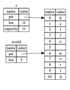

## 参考资料
1. https://kaisery.github.io/trpl-zh-cn/ch03-02-data-types.html
## 常见编程概念
### 变量与可变性
1. 变量：rust中定义的变量默认是不可修改的，如果需要修改，则需要使用mut关键字
```rust
let x = 5;
x = 6; // 报错
let mut x = 5;
x = 6; // 不报错
```
2. 常量：常量使用const关键字定义，**常量必须在定义时指定类型**，且不能使用mut关键字。在声明它的作用域中，常量在整个程序生命周期中都是有效的
```rust
const THREE_HOURS_IN_SECONDS: u32 = 60 * 60 * 3;
```
3. 隐藏：隐藏是指使用同样的变量名来覆盖之前定义的变量，隐藏与变量不可修改不同，隐藏的变量可以覆盖，且新变量类型必须与之前定义的变量类型相同
```rust
let x = 5;
let x = x + 1;
```
### 数据类型
1. <font color=red>补码</font>：正数和0的补码就是其本身。负数的补码是将其**绝对值**按位取反再加1. 负数将补码翻译成原码，需要再取反加1.
2. 使用“--release” flag在release模式中构建时，Rust不会检测会导致panic的整型溢出。相反发生整型溢出的时候，Rust会进行一种被称为二进制补码Wrapping的操作，即回绕。可以使用以下几类标准库提供的原始数字类型方法显示的处理溢出的可能性
    * 所有模式下都可以使用“wrapping_*”方法进行wrapping，如wrapping_add
    * 如果“checked_*"”方法出现溢出，则返回None值
    * 用“overflowing_*”方法返回值和一个布尔值，表示是否出现溢出
    * 用“saturating_*”方法在值的最小值或最大值处进行饱和处理
3.  Rust中使用单引号声明char字面量，使用双引号声明字符串字面量。char类型的大小为四个字节，并代表一个unicode标量值。因此Rust的char类型可以表示很多字符甚至是表情符号
4. Rust有两个原生的复合类型：元组(tuple)和数组(array)
    * 元组是将一个或多个类型的值组合进一个复合类型的方式。<font color=red>元组长度固定，一旦声明，其长度不会增大或缩小</font>。使用包含在圆括号中的逗号分隔的值列表来创建一个元组。
        ```rust
        fn main() {
            let x : (i32, f64, u8) = (500, 5.4, 1);
            let tup = (500, 6.4, 1); //两种定义方式都可以
            let (x, y, z) = tup; //解构元组
            let one = tup.0; //可以使用“.”后跟索引值直接访问元素
        }
        ```
    **不带任何值的元组称为单元元组， 写作“(),通常表示空值或空的返回类型。<font color=red>如果表达式不返回任何类型的值，则会隐式的返回单元值</font>**
    * 数组类型，与元组的区别在于每个元素的类型必须相同。将数组的值写在方括号中(与c++不同)，使用逗号分隔。<font color=red>数组所申请的内存在栈上，vector申请的内存在堆上</font>。
        ```rust
        fn main() {
            let a = [1,2,3,4,5];
            let a:[i32; 5] = [1,2,3,4,5];//在方括号中包含元素类型，后跟分号，再后跟数组元素的数量
            let a = [3;5];//通过在方括号中指定初始值加分号再加元素个数的方式来创建一个每个元素都相同的数组
            let one = a[0];
        }
        ```
    ***<font color=red>疑问：</font> 1. 元组和数组中， 访问元素，将元素值赋值给了其他变量，期间所有权是否发生转移？   2. rust中没有map和set等原生的复合类型？***

### 函数
1. Rust不关心函数定义所在位置，只要函数被调用时出现在调用处可见的作用域内就行(与c/c++不同)。<font color=red>那么Rust编译器在编译代码的时候的行为是怎么样的呢，如何保证的这一特性？</font>
2. 语句是执行一些操作但不返回值的指令。表达式计算并产生一个值。
   * 语句：
     * 声明语句(例如：let绑定)
     * 表达式语句(带分号的表达式)
   * 表达式: 是计算并返回一个值的代码块。表达式可以嵌套在其他表达式中。

### 控制流
1. if 表达式：Rust有if/else if/else。<font color=red>Rust不会尝试自动将非布尔值转换为布尔值</font>.所以必须显示的使用bool值作为if的条件。
2. **在let语句中使用if**：因为if是一个表达式，我们可以在let语句的右侧使用它。<font color=red>注意：if的每个分支可能得返回值都必须是相同类型，否则会编译失败</font>
   ```rust
   fn main() {
    let condition = true;
    let number = if condition {5} else {6};
    println!("The value of number is :{number}");
   }
   ```
3. Rust中有3种循环：loop，while和for
   * loop：告诉Rust一遍又一遍的执行一段代码，直到明确要求停止。
     * <font color = red>loop循环，可以使用break表达式，将结果带出去传递给其他代码</font>
        ```rust
        fn main() {
            let mut counter = 0;
            let result = loop {
                counter+=1;
                if counter == 10 {
                    break counter * 2;
                }
            };
            println!("The result is {result}");
        }
        ``` 
     *<font color = red> 在嵌套循环中，可以讲循环打上标签，并使用break或者countinue来指定跳转到哪层循环</font> 
        ```rust
        fn main() {
            let mut count = 0;
            'counting_up: loop {
                println!("count = {count}");
                let mut remaining = 10;

                loop {
                    println!("remaining = {remaining}");
                    if remaining == 9 {
                        break;
                    }
                    if count == 2 {
                        break 'counting_up; 
                    }
                    remaining -= 1;
                }

                count += 1;
            }
            println!("End count = {count}");
        }
        ```
        上面代码的 break 'counting_up 表示跳出最外层的循环
   * while：当条件为true时进入循环，当条件不再为true或者使用break来退出循环。
   * for：

## 所有权
### 什么是所有权
所有权是rust用于管理内存的一组规则。通过所有权系统管理内存(主要是堆内存)，编译器在编译时会根据一系列规则进行检查。如果违反规则将会导致编译不通过。
#### 所有权规则
1. <font color=red>Rust中的每个值都有一个所有者</font>
2. <font color=red>值在任一时刻有且仅有一个所有者</font>
3. <font color=red>当所有者离开作用域，这个值将会被丢弃。</font>

#### String类型
***<font color=red>如何判定一个变量的内存是在堆上还是栈上呢？ 比如用户自己定义的一个结构体. 这影响到copy和clone的使用</font>***
### 引用与借用
***<font color = red>引用是否破坏了所有权关系呢？ 是否会出现引用代码还未结束，其所有权被释放的场景？  在被借用时，所有权是否可以修改对象的值呢？</font>***

### Slice类型
slice允许你引用集合中一段连续的元素序列，而不用引用整个集合。<font color =red>slice是一种引用，所以它没有所有权</font>


## 结构体
rust 结构体不允许只将某个字段标记为可变而这个结构体不可变。

### 结构体的定义好实例化
定义结构体需要使用struct关键字并为整个结构体提供一个名字。接着在大括号中第每一部分数据的名字和类型，我们称之为字段，字段之间使用逗号分隔。例：
```rust
struct User {
    active: bool,
    username: String,
    email: String,
    sign_in_count: u64,
}
```
实例化一个结构体如下：
```rust
fn main() {
    let user1 = User {
        active: true,
        username: String::from("Someusername123"),
        email: String::from("Someone@example.com"),
        sign_in_count: 1,
    };
    user1.email = String::from("anotheremail@example.com"); //将导致编译错误，因为user1是不可变的。
}
```
如果要访问结构体成员需要使用“.”符号进行访问。并且<font color=red>如果想要修改某一成员的值，首先整个实例必须是可变的。Rust不允许只将某一个字段标记为可变</font>

#### 使用结构体更新语法从其他实例创建实例
使用旧实例的大部分值但变更其部分值来创建一个新的结构体实例，可以通过结构体更新语法实现。例：
```Rust
fn main() {
    // --snip--

    let user2 = User {
        active: user1.active,
        username: user1.username,
        email: String::from("another@example.com"),
        sign_in_count: user1.sign_in_count,
    };

    let user2 = User {
        email: String::from("another@example.com");
        ..user1
    };
}
```
**我们使用“..”语法指定了剩余未显式设置值的字段应有与给定实例对应字段相同的值**
<font color=red>注意，结构更新语法就像带有=的赋值，因为它移动了数据。因此在创建了新的结构体之后，老的结构体将无法使用。</font>

#### 使用没有命名字段的元组结构体来创建不同的类型
可以定义与元组类似的结构体，称为<font color=red>元组结构体</font>。元组结构体有着结构体名称提供的含义，但没有具体的字段名，只有字段的类型。
```rust
struct Color(i32, i32, i32);
struct Point(i32, i32, i32);
fn main() {
    let black = Color(0, 0, 0);
    let origin = Point(0, 0, 0);

    let Color(x,y,z) = black;
    println!("{} {} {}", x, y, z);
    println!("{}", black.0);
}
```
注意black和origin值的类型不同，他们属于不同的元组结构体实例。
