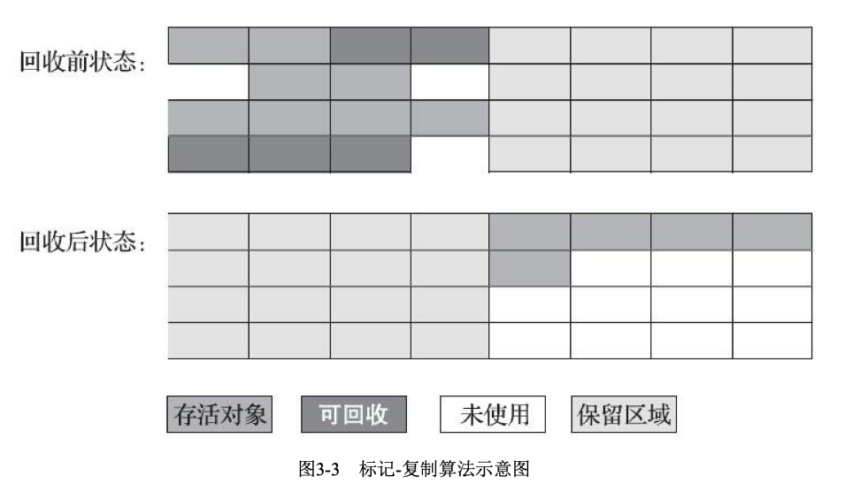
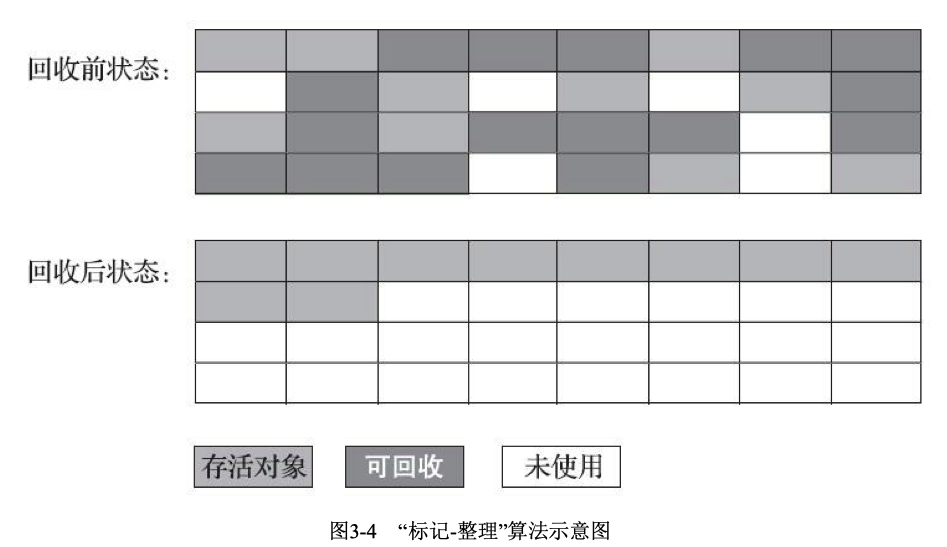

* 哪些内存要回收？
* 什么时候回收？
* 如何回收？

**java虚拟机中的 程序计数器，虚拟机栈， 本地方法栈这三个区域随线程的产生而产生，随线程的消亡而消亡，因此这几个区域内存的分配回收具有确定性**。<font color = red> 而java的堆和方法区这两个区域有着很明显的不确定性， 这便是垃圾收集器所关注的区域</font>
## 对象死亡判断
如何判断一个对象是否死亡呢？
1. 引用计数器，在对象创建时添加一个引用计数器，当有人引用时，计数器+1，引用接解除时计数器-1.当计数器减为0时，则释放对象
    
    优点：效率高
    
    缺点：在比较复杂的情况下，需要大量的额外处理保证引用的正确。比如对象之间的循环引用问题
    ```
    public class ReferenceCountingGC {

        public Object instance = null;

        private static final int _1MB = 1024 * 1024;

        /*这个成员属性的唯一意义就是占点内存，以便能在GC日志中看清楚是否有回收过 */

        private byte[] bigSize = new byte[2 * _1MB];

        public static void testGC() {

            ReferenceCountingGC objA = new ReferenceCountingGC();
            ReferenceCountingGC objB = new ReferenceCountingGC();
            objA.instance = objB;
            objB.instance = objA;

            objA = null;
            objB = null;

            // 假设在这行发生GC，objA和objB是否能被回收
            System.gc();
        }

    }
    ```
2. 可达性分析算法

    java虚拟机就是根据可达性分析算法来判断对象是否还存活。这个算法的基本思路是通过一系列称为“GC Roots”的根对象作为起始节点集向下开始搜索。如果一个对象和GC Roots间没有任何引用链接，那么此对象将被认定为不再被使用
    

    **GC Roots的对象包括以下几种**
    
    * 在虚拟机栈中引用的对象，如各个县城的方法栈中使用到的参数，局部变量，临时变量
    * 在方法区中静态属性引用的对象，如java类的引用类静态变量 <font color = red>? </font>
    * 在方法区中常量引用的对象，如字符串常量池例的引用
    * 在本地方法栈中JNI(Native方法)引用的对象<font color = red>? </font>
    * Java虚拟机内部的引用，如基本数据类型对应的Class对象，一些常驻的异常对象(如NullPointException, OutOfMemoryError等)，还有系统类加载器
    * 所有被同步锁(synchronized关键字)持有的对象
    * 反映Java虚拟机内部情况的JNXBean，JVNTI中注册的毁掉，本地代码缓存等<font color = red>? </font>

    **关于引用**

    强引用，软引用，弱引用和虚引用，引用强度一次递减

    *  **强引用** 是最传统的“引用”定义，指在程序代码中普遍存在的引用赋值("Object obj = new Object()") 只要强引用关系还存在，垃圾收集器就永远不会收掉被引用的对象
    * **软引用** 用来描述一些还有用，但非必须的对象。只被软引用关联的对象在系统将要发生内存溢出异常前会把这些对象列进回收范围之中进行第二次回收，如果这次回收后内存还不够，才会抛出内存溢出异常。jdk提供了SoftReference类来实现软引用。
    *  **弱引用** 也是用来描述那些非必须对象，但是强度比软引用更弱，被弱引用关联的对象只能生存到下一次垃圾收集发生为止。jdk提供了WeakReference类来实现弱引用。
    *  **虚引用** 是最弱的一种引用关系。一个对象是否有虚引用的存在，完全不会对其生存时间构成影响，也无法通过虚引用来获取一个对象实例。<font color=red>为一个对象甚至虚引用关联的唯一目的是为了在这个对象被收集器回收时收到一个系统通知</font>.jdk提供了PhantomReference类来实现虚引用。
    
    Q:一个对象可以同时存在多种引用吗？
    
    A:
    
    Q:软引用，弱引用和虚引用的实际使用场景，举例

    A：


3. 对象的生死

    即使可达性分析判定对象不可达，该对象也不会再下一次GC回收时被回收。**真正宣告一个对象的死亡，至少要经历两次标记过程** 如果对象在进行可达性分析发现对象没有与GC Roots相连接，将会第一次标记。如果该对象有finalize()函数且还没有被执行，则会将该对象放置到一个名为F-Queue的队列中。并稍后由一条由虚拟机自动创建的，低优先级的Finalize线程去执行finalize()方法。**finalize方法是对象逃脱死亡命运的最后一次机会，稍后收集器将对F-Queue中的对象进行第二次标记，在这之前如果对象可以和链上对象建立联系，则不会被回收**
    <font color=red>finalize方法只会被执行一次</font>

    Q:如果没有finalize函数，对象在第一次标记后就会被回收吗？

    A:

4. 回收方法区
   
    《Java虚 拟机规范》中提到过可以不要求虚拟机在方法区中实现垃圾收集

   方法区的垃圾收集主要回收两部分内容：**废弃的常量**和**不再使用的类型**

   要判断一个类型是否属于不再使用必须同时满足下面三个条件：
    1. 该类的所有实例都已经被回收，也就是Java堆中不存在该类及其任何派生类的实例
    2. 加载该类的类加载器已经被回收。(这个条件除非是经过精心设计的可替换类加载器的场景)
    3. 该类对应的java.lang.Class对象没有在任何地方被引用，无法在任何地方通过反射访问该类的方法

## 垃圾收集算法
<font color = gren>对其中的理论细节感兴趣，推荐阅读Richard Jones撰写的《垃圾回收算法手册》</font>


1. 分代收集理论
   * 弱分代假说：绝大多数对象都是朝生夕灭。
   * 强分代假说：熬过越多次垃圾收集过程的对象就越难消亡
   * 跨代假说：跨代医用相对于同代引用来说仅占极少数

2. 不同分代相关名词解释
    * 部分收集(Partial GC) : 指目标不是完整收集整个Java堆的垃圾收集。其中又分为
      * 新生代收集(Minor GC/Young GC):指目标只是新生代的垃圾收集
      * 老年代收集(Major GC/Old GC):指目标只是老年代的垃圾收集
      * 混合收集(Mixed GC)：指目标是收集整个新生代及部分老年代的垃圾收集。
    * 整堆收集(Full GC):收集整个Java堆和方法区的垃圾收集

    java虚拟机堆划分，至少会划分出新生代和老年代两个区域。每次垃圾收集时，新生代中都有大批对象死去，少量对象存活，这些存活的少量对象会逐步晋升到老年代中。

    由于可能存在老年代对象对新生代对象进行跨代引用。为了避免为了少数新生代的回收而去扫描整个老年代的GC Roots。只需在新生代上建立一个全局的数据结构，这个结构将老年代划分为多个小块，标识出老年代的那一块内存存在跨代引用， 在GC时只需对这一小块内存的对象进行扫描。

### 标记-清除算法
算法思路：标记出需要回收的对象，标记完成后统一回收所有的标记对象。

缺点：
    1. 执行效率不稳定，该算法的执行效率与内存中需要标记清除的对象数量成正相关
    2. 内存空间碎片化严重。
    

### 标记-复制算法
算法思路：将可用内存划分为相等两块，每次只用其中的一块，当一块内存用完了，将还存活的对象拷贝到另一块上，然后把已使用的这块空间清零。

优点：减少了空间碎片的产生

缺点：1.可用内存大小缩减为原来的一半，空间浪费严重。复制对象开销较大(只不过有一个上限，即一半的内存)。

当前大多虚机都优先采用这种算法回收新生代。只不过没有按照1:1来划分新生代空间

### 标记-整理算法
其中的标记过程与”标记-清除“法一样，只是后续步骤不是直接对可回收对象进行清理，而让所有存活对象都想内存空间一端移动，然后直接清理掉边界以外的内存。

优点：不会产生内存碎片

缺点：1. 在老年代，大多对象都是可存活的，移动对象并更新对象的引用对系统负担较大，并且在移动过程中必须暂停用户应用(Stop The World)对系统性能影响较大


## HotSpot算法细节
### 根节点枚举
