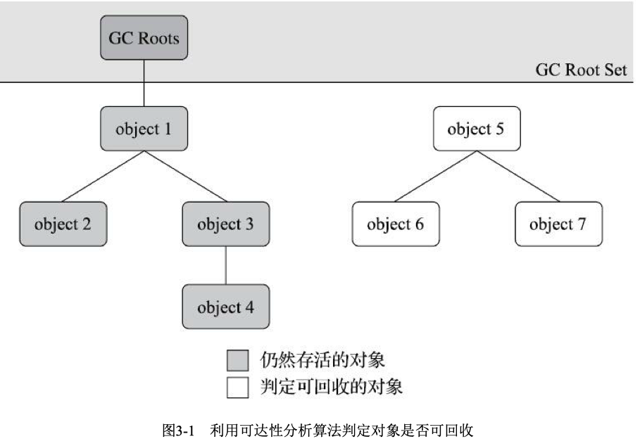
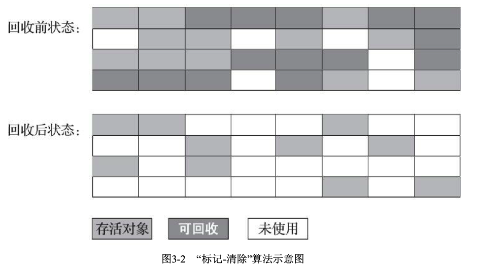
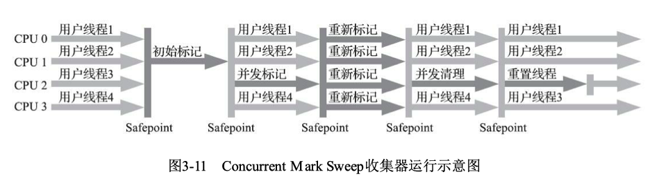

* 哪些内存要回收？
* 什么时候回收？
* 如何回收？

**java虚拟机中的 程序计数器，虚拟机栈， 本地方法栈这三个区域随线程的产生而产生，随线程的消亡而消亡，因此这几个区域内存的分配回收具有确定性**。<font color = red> 而java的堆和方法区这两个区域有着很明显的不确定性， 这便是垃圾收集器所关注的区域</font>
## 对象死亡判断
如何判断一个对象是否死亡呢？
1. 引用计数器，在对象创建时添加一个引用计数器，当有人引用时，计数器+1，引用接解除时计数器-1.当计数器减为0时，则释放对象
    
    优点：效率高
    
    缺点：在比较复杂的情况下，需要大量的额外处理保证引用的正确。比如对象之间的循环引用问题
    ```
    public class ReferenceCountingGC {

        public Object instance = null;

        private static final int _1MB = 1024 * 1024;

        /*这个成员属性的唯一意义就是占点内存，以便能在GC日志中看清楚是否有回收过 */

        private byte[] bigSize = new byte[2 * _1MB];

        public static void testGC() {

            ReferenceCountingGC objA = new ReferenceCountingGC();
            ReferenceCountingGC objB = new ReferenceCountingGC();
            objA.instance = objB;
            objB.instance = objA;

            objA = null;
            objB = null;

            // 假设在这行发生GC，objA和objB是否能被回收
            System.gc();
        }

    }
    ```
2. 可达性分析算法

    java虚拟机就是根据可达性分析算法来判断对象是否还存活。这个算法的基本思路是通过一系列称为“GC Roots”的根对象作为起始节点集向下开始搜索。如果一个对象和GC Roots间没有任何引用链接，那么此对象将被认定为不再被使用
    

    **GC Roots的对象包括以下几种**
    
    * 在虚拟机栈中引用的对象，如各个县城的方法栈中使用到的参数，局部变量，临时变量
    * 在方法区中静态属性引用的对象，如java类的引用类静态变量 <font color = red>? </font>
    * 在方法区中常量引用的对象，如字符串常量池例的引用
    * 在本地方法栈中JNI(Native方法)引用的对象<font color = red>? </font>
    * Java虚拟机内部的引用，如基本数据类型对应的Class对象，一些常驻的异常对象(如NullPointException, OutOfMemoryError等)，还有系统类加载器
    * 所有被同步锁(synchronized关键字)持有的对象
    * 反映Java虚拟机内部情况的JNXBean，JVNTI中注册的毁掉，本地代码缓存等<font color = red>? </font>

    **关于引用**

    强引用，软引用，弱引用和虚引用，引用强度一次递减

    *  **强引用** 是最传统的“引用”定义，指在程序代码中普遍存在的引用赋值("Object obj = new Object()") 只要强引用关系还存在，垃圾收集器就永远不会收掉被引用的对象
    * **软引用** 用来描述一些还有用，但非必须的对象。只被软引用关联的对象在系统将要发生内存溢出异常前会把这些对象列进回收范围之中进行第二次回收，如果这次回收后内存还不够，才会抛出内存溢出异常。jdk提供了SoftReference类来实现软引用。
    *  **弱引用** 也是用来描述那些非必须对象，但是强度比软引用更弱，被弱引用关联的对象只能生存到下一次垃圾收集发生为止。jdk提供了WeakReference类来实现弱引用。
    *  **虚引用** 是最弱的一种引用关系。一个对象是否有虚引用的存在，完全不会对其生存时间构成影响，也无法通过虚引用来获取一个对象实例。<font color=red>为一个对象甚至虚引用关联的唯一目的是为了在这个对象被收集器回收时收到一个系统通知</font>.jdk提供了PhantomReference类来实现虚引用。
    
    Q:一个对象可以同时存在多种引用吗？
    
    A:
    
    Q:软引用，弱引用和虚引用的实际使用场景，举例

    A：


3. 对象的生死

    即使可达性分析判定对象不可达，该对象也不会再下一次GC回收时被回收。**真正宣告一个对象的死亡，至少要经历两次标记过程** 如果对象在进行可达性分析发现对象没有与GC Roots相连接，将会第一次标记。如果该对象有finalize()函数且还没有被执行，则会将该对象放置到一个名为F-Queue的队列中。并稍后由一条由虚拟机自动创建的，低优先级的Finalize线程去执行finalize()方法。**finalize方法是对象逃脱死亡命运的最后一次机会，稍后收集器将对F-Queue中的对象进行第二次标记，在这之前如果对象可以和链上对象建立联系，则不会被回收**
    <font color=red>finalize方法只会被执行一次</font>

    Q:如果没有finalize函数，对象在第一次标记后就会被回收吗？

    A:

4. 回收方法区
   
    《Java虚 拟机规范》中提到过可以不要求虚拟机在方法区中实现垃圾收集

   方法区的垃圾收集主要回收两部分内容：**废弃的常量**和**不再使用的类型**

   要判断一个类型是否属于不再使用必须同时满足下面三个条件：
    1. 该类的所有实例都已经被回收，也就是Java堆中不存在该类及其任何派生类的实例
    2. 加载该类的类加载器已经被回收。(这个条件除非是经过精心设计的可替换类加载器的场景)
    3. 该类对应的java.lang.Class对象没有在任何地方被引用，无法在任何地方通过反射访问该类的方法

## 垃圾收集算法
<font color = gren>对其中的理论细节感兴趣，推荐阅读Richard Jones撰写的《垃圾回收算法手册》</font>


1. 分代收集理论
   * 弱分代假说：绝大多数对象都是朝生夕灭。
   * 强分代假说：熬过越多次垃圾收集过程的对象就越难消亡
   * 跨代假说：跨代医用相对于同代引用来说仅占极少数

2. 不同分代相关名词解释
    * 部分收集(Partial GC) : 指目标不是完整收集整个Java堆的垃圾收集。其中又分为
      * 新生代收集(Minor GC/Young GC):指目标只是新生代的垃圾收集
      * 老年代收集(Major GC/Old GC):指目标只是老年代的垃圾收集
      * 混合收集(Mixed GC)：指目标是收集整个新生代及部分老年代的垃圾收集。
    * 整堆收集(Full GC):收集整个Java堆和方法区的垃圾收集

    java虚拟机堆划分，至少会划分出新生代和老年代两个区域。每次垃圾收集时，新生代中都有大批对象死去，少量对象存活，这些存活的少量对象会逐步晋升到老年代中。

    由于可能存在老年代对象对新生代对象进行跨代引用。为了避免为了少数新生代的回收而去扫描整个老年代的GC Roots。只需在新生代上建立一个全局的数据结构，这个结构将老年代划分为多个小块，标识出老年代的那一块内存存在跨代引用， 在GC时只需对这一小块内存的对象进行扫描。

### 标记-清除算法
算法思路：标记出需要回收的对象，标记完成后统一回收所有的标记对象。

缺点：
    1. 执行效率不稳定，该算法的执行效率与内存中需要标记清除的对象数量成正相关
    2. 内存空间碎片化严重。
    

### 标记-复制算法
算法思路：将可用内存划分为相等两块，每次只用其中的一块，当一块内存用完了，将还存活的对象拷贝到另一块上，然后把已使用的这块空间清零。

优点：减少了空间碎片的产生

缺点：1.可用内存大小缩减为原来的一半，空间浪费严重。复制对象开销较大(只不过有一个上限，即一半的内存)。

当前大多虚机都优先采用这种算法回收新生代。只不过没有按照1:1来划分新生代空间

### 标记-整理算法
其中的标记过程与”标记-清除“法一样，只是后续步骤不是直接对可回收对象进行清理，而让所有存活对象都想内存空间一端移动，然后直接清理掉边界以外的内存。

优点：不会产生内存碎片

缺点：1. 在老年代，大多对象都是可存活的，移动对象并更新对象的引用对系统负担较大，并且在移动过程中必须暂停用户应用(Stop The World)对系统性能影响较大


## HotSpot算法细节
### 根节点枚举
固定可作为GC Roots的节点主要在全局性的引用(如常量或静态属性)与执行上下文(如栈帧中的本地变量表)中。
由于需要找到所有根节点，因此在进行根节点扫描的时候，必须暂停用户线程。即“Stop the World”。

<font color=red>优化方案：</font>
HotSpot使用一组称为OopMap的数据结构。一旦类加载动作完成，HotSpot就会把对象内什么偏移量上是什么类型的数据计算出来，在即时编译过程中，也会在**特定的位置**记录下栈里和寄存器里那些位置是引用。这样收集器在扫描的时候就能直接得知这些信息。(每个类都会生成自己的oopmap，并且各个类的oopmap没有集中在一起)

### 安全点
HotSpot没有为每条指令生成oopmap，而是在特定位置生成，这些位置被称为<font color=red>安全点</font>。有了安全点的设定，决定了用户执行时并非在代码指令流的任意位置都能停顿下来进行垃圾收集。是<font color=red>强制要求必须执行到达安全点后才能暂停</font>。

安全点不能太多页不能太少，太多的话会挤压用户程序的内存空间(oopmap也会占用一定内存)。太少的话会让收集器等待时间过长。

如何让所有线程在垃圾收集发生时都跑到最近的安全点并停下来呢？
* 使用抢先式中断，抢先式中断不需要线程的执行代码主动配合，在垃圾收集发生时，系统将中断所有用户线程，如果发现线程没有在安全点上，就恢复这条线程的执行，让他跑一会重新中断，直到跑到安全点上。(可能存在多次中断都没在安全点上)
* 主动式中断，垃圾收集器在需要中断线程时，系统设置一个标志位，各个线程执行过程中会不停的主动去轮询这个标志位，一旦发现标志位为真就在自己最近的安全点上主动挂起。
  
>轮询标志的地方和安全点是重合的，另外还要加上所有创建对象和其他 需要在Java堆上分配内存的地方，这是为了检查是否即将要发生垃圾收集，避免没有足够内存分配新 对象。
由于轮询操作在代码中会频繁出现，这要求它必须足够高效。HotSpot使用内存保护陷阱的方式， 把轮询操作精简至只有一条汇编指令的程度。下面代码清单3-4中的test指令就是HotSpot生成的轮询指 令，当需要暂停用户线程时，虚拟机把0x160100的内存页设置为不可读，那线程执行到test指令时就会 产生一个自陷异常信号，然后在预先注册的异常处理器中挂起线程实现等待，这样仅通过一条汇编指 令便完成安全点轮询和触发线程中断了。
```
0x01b6d627: call 0x01b2b210                ; OopMap{[60]=Oop off=460}
                                           ; *invokeinterface size
                                           ; - Client1::main@113 (line 23)
                                           ;{virtual_call} 
0x01b6d62c: nop                            ; OopMap{[60]=Oop off=461}
                                           ; *if_icmplt
                                           ; - Client1::main@118 (line 23)
0x01b6d62d: test      %eax,0x160100        ; {poll}
0x01b6d633: mov       0x50(%esp),%esi
0x01b6d637: cmp       %eax,%esi
```
### 安全区域
安全点机制保证了程序执行时，在不太长的事假内遇到可进入垃圾收集过程的安全点。但是那些在这个时候没有被分配处理器事件的线程(处于block或者sleep状态)将无法相应虚机的中断请求，无法将自己中断挂起。所以必须引入<font color=red>安全区域</font>来解决

<font color=red>安全区域</font>指能确保在某一段代码片段中，引用关系不会发生变化。在这个区域中开始收集垃圾都是安全的。

当用户线程执行到安全区时，首先会标识自己已经进入安全区。这样这段时间虚机如果发起垃圾收集，将会忽略这些线程。当线程要离开安全区时，线程要先检查虚机是否已经完成根节点枚举，如果完成了，线程可以继续执行，否则一直等到完成为止。<font color=red>安全区域是一个逻辑概念，当线程sleep之前，可以将自己标记为进入安全区，此时线程只能等到根节点枚举结束才能醒来</font>

### 记忆集与卡表
记忆集是一种用于记录从非收集区域指向收集区域的指针集合的抽象数据结构。由于垃圾收集场景中，收集器只需要通过记忆集判断出某一块非收集区域是否存在指向收集区域的指针就可以了，因此记忆集并不需要记录跨代指针的全部细节。

因此可以使用一种被成为卡表(Card Table)的方式去实现记忆集。 卡表最简单的形式就是一个字节数组。
```
CARD_TABLE [this address >> 9] = 0;
```
CARD_TABLE的每个元素对应一块2的9次幂的大小的内存块。因此一个卡页的内存通常包含布置一个对象，只要卡页内有一个或多个对象的字段存在跨代，就将这个数组元素标为1，称这个元素变脏了。

### 写屏障
我们在编写java程序时并没有感知到卡表，因此卡表是在编译阶段和虚拟机运行时生成的。那么**如何在对象赋值的那一刻去更新卡表内容呢？** HotSpot虚机<font color=red>通过写屏障(Write Barrier)技术维护卡表状态</font>

写屏障可以看作在虚拟机层面对“引用类型字段赋值”这个动作的AOP切面，在引用对象赋值时会产生一个环形（Around）通知，供程序执行额外的动作，也就是说赋值的前后都在写屏障的覆盖范畴内。在赋值前的部分的写屏障叫作写前屏障（Pre-Write Barrier），在赋值 后的则叫作写后屏障（Post-Write Barrier）。HotSpot虚拟机的许多收集器中都有使用到写屏障，但直 至G1收集器出现之前，其他收集器都只用到了写后屏障。例：
```
void oop_field_store(oop *field, oop new_value){
    //引用字段赋值操作
    *field= new_value;
    //写后屏障，在这里完成卡表状态更新
    post_write_barrier(field, new_value);
}
```
<font color=red>卡表在高并发场景下还存在“伪共享”问题</font>。处理器读取缓存系统中的数据时，是以缓存行为单位读取，存储的。 当多个线程修改的变量在同一缓存行时，那么他们为了避免数据相互覆盖，必然无法同时操作，从而降低了性能，这就是伪共享问题。

### 并发可达性分析
三色标记法：
* 白色：表示对象尚未被垃圾收集器访问过。显然在可达性分析刚开始的阶段，所有对象都是白色。若在分析结束的阶段，任然为白色的对象，即代表不可达。
* 黑色：表示对象和已经被垃圾收集器访问过，且这个对象所引用的所有对象都已经扫描过。如果有其他对象医用指向黑色对象，无需重新扫描。黑色对象不能直接指向白色对象。
* 灰色：表示对象已经被垃圾收集器访问过，但这个对象上至少存在一个引用还没被扫描过。

***当且仅当一下两种情况同时满足，原本应该是黑色对象被标记为白色***
* 复制器插入一条或多条从黑色对象到白色对象的新引用(因为黑色对象不会在被扫描)
* 复制器删除了全部从灰色对象到该白色对象的直接或间接引用

因此要解决并发扫描时对象消失问题，只需破坏两条中的任意一条即可。由此产生两种解决方案 <font color=red>增量更新(Incremental Update)和原始快照(SATB)</font>.
* 增量更新破坏的是第一个条件。当黑色对象插入新的指向白色对象的引用关系时，将这个新插入的引用关系记录下来，等扫描结束后，将这些记录过的引用关系中的黑色为根 ，重新扫描一次
* 原始快照破坏的是第二个条件，当灰色对象删除指向白色对象的引用关系时，将这个删除的引用记录下来，扫描结束后，以这些灰色对象为根重新扫描。

## 经典的垃圾收集器
### CMS收集器
CMS(Concurrent Mark Sweep)收集器是一种以获取最短回收停顿时间为目标的收集器。CMS是基于标记-清除算法实现的。运行过程分为以下四步：
1. 初始标记(CMS initial mark)
2. 并发标记(CMS concurrent mark)
3. 重新标记(CMS remark)
4. 并发清除(CMS concurrent sweep)

<font color=red>其中初始标记，重新标记这两部仍需要”Stop the world“</font>。
1. 初始标记仅仅只是标记一下GC Root 能直接关联到的对象，速度很快。
2. 并发标记阶段就是从GC Roots的直接关联对象开始遍历整个对象图的过程，此过程不需要停顿用户线程。
3. 重新标记则是为了修正并发标记时期，因用户程序运作而导致的标记产生变动的那一部分对象的标记记录，这个阶段的停顿时间通常比初始标记稍长
4. 最后并发清除阶段，清理掉标记阶段判断的已死亡的对象，该阶段可以与用户线程并发。


CMS的缺点：
1. CMS收集器对处理器资源非常敏感，由于是多线程(默认启动线程为 处理器核心数量+3 /4)，且可以和用户线程并发，会因为抢夺了cpu资源而使得应用程序变慢。
2. CMS无法处理”浮动垃圾(并发清理时，由于并发运行，用户线程新产生的垃圾对象)“，有可能出现”Con-current MOde Failure“失败进而导致另一次完全”Stop the World“的Full GC的产生(由于并行，因此必须给用户线程留足空间以分配新的对象(<font color=red>此时用户线程新对象分配在了老年代上？</font>)，如果此时空间不足，无法分配新的对象，则会造成并发失败，虚机将采用Serial Old收集器来收集老年代的垃圾。)
3. CMS是基于标记清除法的收集器意味着会产生大量的内存碎片，最终需要Full GC来进行内存整理。

关于增量式并发收集器(已被废弃)：它是CMS收集器的一个变种。由于CMS对资源敏感，在核心数很少的情况下，对程序的性能影响很大，因此增量式并发收集器让垃圾收集线程和用户线程交替进行，使得在用户感知上用户线程的速度下降没那么明显。但实践证明效果不佳，已被废弃。


### Garbage First 收集器
Garbage First 简称G1，是一款面向服务端应用的垃圾收集器。目标是替换CMS。

停顿时间模型：能够支持指定在一个长度为M毫秒的时间片内，消耗在垃圾收集上的时间大概率不超过N毫秒。

在G1之前的收集器，垃圾收集的目标要么是整个新生代(Minor GC)，要么是整个老年代(Major GC)，要么是整个Java堆(Full GC).<font color=red>而G1可以面向堆内任何部分来组成回收集(Collection Set)进行回收</font>。不区分它属于哪个分代，哪块内存垃圾最多就回收哪一块。

<font color=red>G1不再坚持固定大小以及固定数量的非带区域划分，而是把连续的Java堆划分为多个大小相等的独立区域(Region)</font>,每个区域都可以根据需要扮演新生代的Eden空间，Survivor空间或者老年代空间。

<font color=red>Region中还有一类特殊的区域Humongous区域，专门用来存储大对象(超过Region容量一般的对象即可认为是大对象)</font>。G1的大多数行为都是把Humongous Region作为老年代的一部分来看待。

<font color=red>***G1将region作为单次回收的最小单元***</font>每次收集的空间都是Region的整数倍。

G1收集器会跟踪各个Region里面的垃圾堆积的价值(**回收所获得的空间大小以及回收所需时间的经验值**)大小，然后在后台维护一个优先级列表，每次根据用户设定的允许停顿的时间(-XX:MaxGCPauseMillis)优先处理回收价值收益最大的那些Region

Q:G1是如何解决跨Region引用的呢？

A:每个Region都维护着自己的记忆集。这些记忆集记录着别的Region指向自己的指针，并标记这些指针分别在哪些卡页的范围内。G1的记忆集在存储结构上本质是一种hash表，key表示别的Region的起始地址，value是一个集合，里面存的是卡表的索引号。