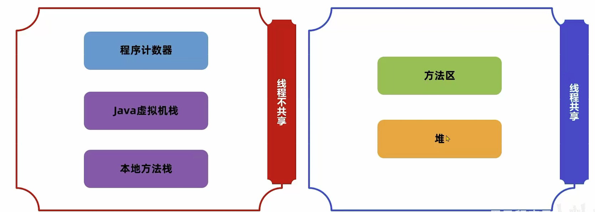
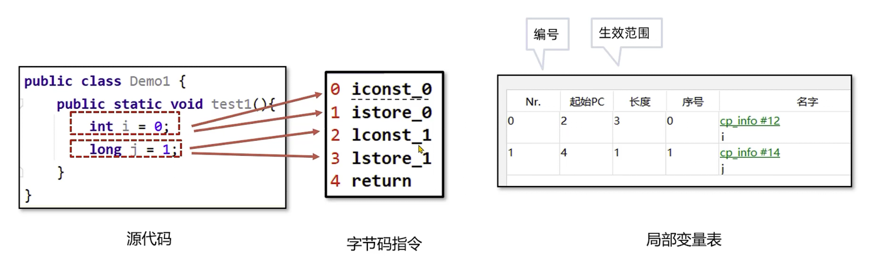
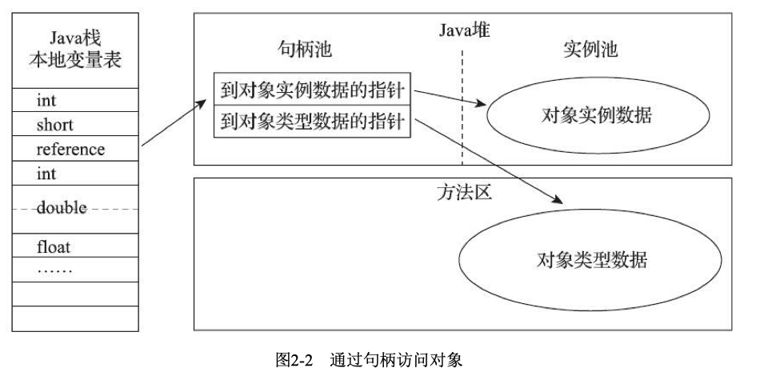
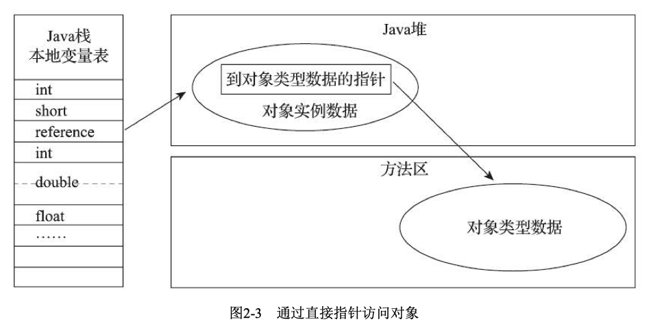

## 运行时数据区域

1. 程序计数器
程序计数器是一块较小的内存空间，可看做是当前线程所执行的字节码的行号指示器。每个线程都有一个独立的程序计数器，各个县城间的程序计数器互不影响，独立存储。 我们称这个内存区域为线程私有的内存。
每个线程拥有独立的计数器是为了保证线程切换后能恢复到正确的执行位置。
**如果线程正在执行一个java方法，计数器记录的是正在执行的虚拟机字节码指令的地址，如果是正在执行的是本地方法(Native)，这个计数器值应为空**
2. java虚拟机栈
java虚拟机栈也是线程私有的，生命周期与线程相同。
虚拟机栈描述的是线程内存模型：每个方法被执行时，虚拟机都会创建一个栈帧用于存储**局部变量表，操作数栈，动态链接，方法出口等信息**。
	* **局部变量表**存放着编译期可知的各种java虚机基本数据类型(boolean byte char short int float long double),对象引用以及returnAddress类型(指向了一条字节码指令的地址)。局部变量表中的存储空间是以**局部变量槽**来表示的。
	而变量槽的大小(占多少比特)由虚拟机实现决定。 **其中64位长度的long和double类型的数据占用两个变量槽，其余的数据只占一个变量槽**
	为了节省空间，局部变量表中的槽可以服用，一旦某个局部变量不再生效，当前槽可以再次被其他局部变量使用
	
	* **操作数栈**是栈帧中虚拟机在执行指令过程中用来临时存放数据的一块区域。 操作数栈的最大深度在编译期就可以确定，从而在执行时正确分配内存大小
	* **帧数据**
		* 当前类的字节码指令引用了其他类的属性或方法时，需要将符号引用转换成对应的运行时常量池中的内存地址，动态链接就保存了标号到运行时常量池的内存地址的映射关系。
		* 方法出口指的是方法在正确或者异常结束时，当前栈帧会被弹出，同时程序计数器应该指向上一个栈帧中的下一条指令的地址。所以当前栈帧中需要存储此方法出口的地址

3. 本地方法栈
本地方法栈和虚拟机栈比较相似。只是虚拟机栈为虚拟机执行java方法服务，而本地方法栈则为虚拟机使用的本地方法服务
4. java堆
堆是被所有线程共享的一块内存区域，在虚拟机启动时创建。此内存唯一的目的就是存放对象实例。(但说java的对象实例都分配在堆上时不正确的)
从内存分配的角度看，所有线程共享的java堆可以划分出多个线程私有的分配缓冲区(TLAB)，以提升对象分配时的效率以及更好的回收内存。
5. 方法区
方法区域java堆一样，是各个线程共享的内存区域。用于存储**已被虚拟机加载的类型信息，常量，静态变量，即时编译器编译后的代码缓存等数据**
6. 运行时常量池
运行时常量池是方法区的一部分。Class文件中除了有类的版本，字段，方法，接口等描述信息外，还有意向信息是**常量池表**，用于存放编译期生成的葛总字面量和符号引用.这部分内容将在类加载后存放到方法区的运行时常量池中。
7. 直接内存
直接内存并不是虚拟机运行时数据区的一部分

## 对象的创建，内存布局和访问定位
### 对象创建
例： 当java虚拟机遇到一条字节码new指令时，首先会去检查这个指令的参数(即所new对象的类)是否能在常量池中定位到一个类的符号引用，并检查这个符号引用所代表的类是否被加载，解析和初始化过。如果没有。则先执行类的加载过程
	加载完成后为新生对象分配内存。内存分配完成后，虚机必须讲飞陪到的内存空间都初始化为0. 接下来虚拟机还要对对象进行必要的设置(例如这个对象是哪个类的实例，如何才能找到类的元数据信息，对象的hash码， 对象的GC分代年龄等)
	**之后便开始执行类的构造函数，即class文件中的<init>()方法**

### 对象的内存布局
对象在堆中的存储布局可划分为3个部分：对象头，实例数据和对齐填充
### 对象的访问定位
主流的访问方式有两种：使用句柄和直接指针
1. 句柄，Java堆中将可能会划分出一块内存来作为句柄池，reference中存储的是对象的句柄地址，句柄中包含对象实例的具体信息。

2. 直接指针，java堆对象的存储必须考虑如何放置访问类型的相关信息，reference中存储的直接就是对象地址，如果只是访问对象本身的话，就无需一次间接访问的开销。 但如果是访问对象类型数据的话，访问开销和上述句柄访问相同。
