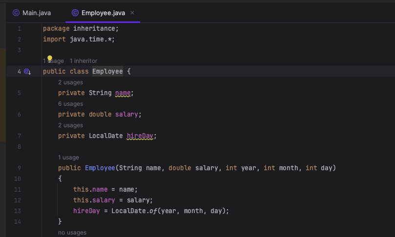
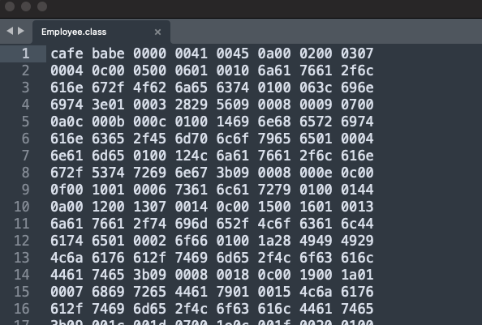

## 类文件结构
Java虚机不予包括java语言在内的任何程序语言绑定，它只与“Class文件”这种特定的二进制文件格式所关联
### Class类文件结构
任何一个class文件都对应着唯一的一个类或接口的定义信息，但**类或接口并不一定都定义在文件里**(类或接口可以动态生成，直接送入类加载器中)

Class文件是一组以8个字节为基础单位的二进制流,各个数据像按照顺序严格紧凑的排列在文件中，中间没有添加任何分隔符。当遇见需要占用8字节以上空间的数据项时，则会按照**高位在前的方式分割成若干个8字节进行存储**
例：在.class文件中以4个16进制数(8字节)为组进行分割

Class文件格式采用一种类似于C语言结构体的伪结构来存储数据。这种伪结构只有两种数据类型：“无符号数”和“表”。
* 无符号数属于基本的数据类型，以u1，u2，u4，u8来分别代表1个字节，2个字节，4个字节和8个字节的无符号数，无符号数可以用来描述数字，索引引用，数量值或者按照UTF-8编码构成字符串值。
* 表是由多个无符号数或者其他表作为数据项构成的复合数据类型，为了便于区分，所有表的命名都以“_info”结尾。
#### 魔数与class文件的版本

---
## 虚拟机类加载机制
