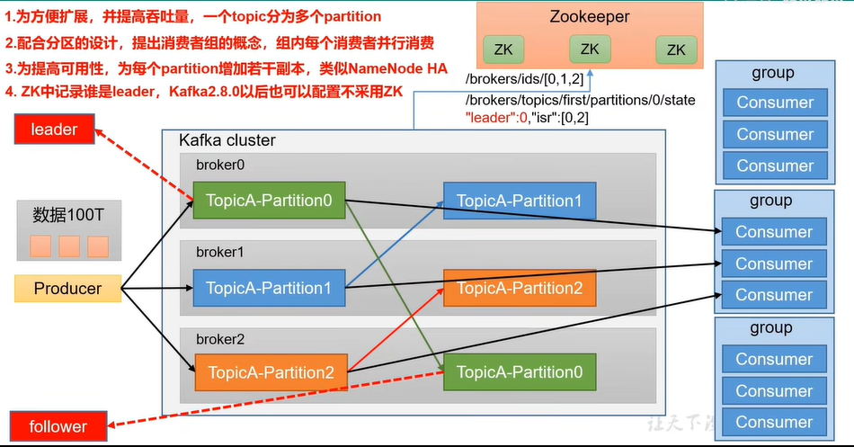

Q:MQ学习
A

## 基础
消息队列的两种模式：
1. 点对点模式：生产者发送消息到卡夫卡消息队列，消费者主动拉取消息，处理完之后给kafka回复确认消息，kafka从队列中删除消息
2. 发布订阅模式：
    * 可以有多个topic
    * 消费者消费数据后，不删除，这样其他消费者也可以获取该消息。

### 基础架构
1. 为提高吞吐量，可以将一个topic分为多个partition(分区)。（此时单个消费者可能成为系统瓶颈）
2. 配合分区的设计。提出消费者组的概念，组内给个消费者并行消费。（但同一个组的消费者不能消费同一个分区的消息）
3. 为提高可用性，为每个patition增加若干个副本。这些副本只用于进行数据备份，只有在leader挂了之后才可能成为主节点并与消费者通信
4. zookeeper记录着谁是leader。但随着发展zk已成为瓶颈(具体什么瓶颈？)，在2.8以后可以配置不采用zk。

