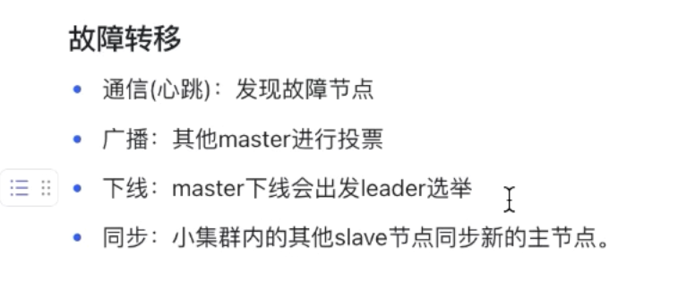

一致性算法 raft
gossip通信 进行集群通信

## 数据分片
相关算法：
    
    1. Hash算法： 性能高  扩展性差 Hudi buket
    2. 一致性hash：扩展得到提升  节点少的时候数据倾斜 
    3. 虚拟槽位分片

## 故障转移

扩缩容 槽位和节点关系的转移

Q：聊聊Redis的集群原理
A：

## 缓存数据一致性
最终一致性： 先更新数据库 后删除缓存+缓存删除重试机制
延时双删？
读取数据库的bin log？

h base是啥？

----

::: headStart
::: start

:::
姓名：罗正燚
性别：男
手机：17863113609
户籍地：四川省宜宾市南溪区
工作年限：3.5年

:::
学历：本科
年龄：29
邮箱：17863113609@sina.cn
现居住地：北京市海淀区

::: end
::: headEnd
## 教育经历
::: start
- **山东大学(威海)-软件工程专业**

:::
**2016.09 - 2020.06**

::: end
主修c/c++, java,计算机网络，操作系统，数据结构与算法
## 专业技能
1. 熟练掌握c/c++相关知识特性并进行项目开发。熟悉Makefile语法

2. 了解 java，jvm，redis等相关知识

3. 熟悉linux环境开发，了解linux内存管理

## 工作经历
::: start
### 北京华为数字技术有限公司    通用软件开发工程师  

:::
**2020.07 - 至今**

::: end

**工作时间：2020.7.17 - 2022.2.07**
**任职部门：云核心网 网关开发部 集成组 工程师 B**
1. 负责制作，修改创建虚机锁使用的VNFD模板，以及创建pod和容器使用的tosca模版
2. 负责部门框架代码的需求开发维护以及网元启动问题的定位工作

**工作时间：2022.03.08 - 至今**
**任职部门：2012实验室 OS内核实验室 工程师 A**
1. 负责TTE开源项目整体框架代码的迁移，重构。以及参与编译框架的重新设计。
2. 作为非安全侧组件以及安全侧业务调度框架责任人&接口人，负责维护TEE的三个非安全侧组件，以及安全侧调度框架的相关问题定位和业务开发
3. 负责机密计算项目中驱动多线程的开发

## 项目经历
::: start
### VNFD模板和tosca模板自动化
::: end
- **技术栈**：python语言

- **项目简介**：由于网关的网元是一个分布式系统，需要在不同的物理机上部署虚拟机，并在虚拟里部署pod与容器。而VNFD模板和tosca模板中记录着虚机和各个pod，容器需要的各个资源大小。为保证减少人为修改造成的错误以及提过模板修改效率。需要实现VNFD模板和tosca模板的自动刷新。

- **工作内容**：

1. 将现有的tosca模板和VNFD模板使用python脚本输出为一个易理解，直观的表格，并保存在库上，使得以后对表格的修改可回溯

2. 编写python脚本，从库上拉取模板的表格，并根据当前表格的信息按照特定的格式生成新的VNFD模板和tosca模板并归档到库上。
- **项目成果**：
1. 使得SE只需修改库上更为直观的表格。借助脚本则可以生成可用模板，减少了人为错误
2. 将原本每次版本更新时平均消耗2天的模板更新时间缩短到了30分钟内。

::: start
### TEE（TrustedExecutionEnvironment）开源项目

::: end
* 技术栈：c/c++语言
* 项目简介：在Open Harmony开源社区对TEE项目进行开源
- **工作内容**
1. 对TEE框架代码进行重构。例如：将部分对全局变量的使用修改为参数传递，为后续TEE的分布式和框架的多线程做铺垫
2. 对非安全侧的system组件进行重构，拆分驱动节点，并使用selinux和DAC权限管控，增强TEE的安全性。
- **项目成果**
TEE代码已开源到OpenHarmony社区。对框架代码整改使得整个框架更加清晰，安全。
::: start
### 机密计算项目TEE驱动框架支持多线程

::: end
- **技术栈**：c/c++ socket通信
- **项目简介**：由于服务器存在同时大量用户访问情况，因此对于TA访问相关驱动需支持多线程并发访问，以增强tee的吞吐量。
- **工作内容**
1. 搭建TA和driver以及driver manager之间的通信框架
2. 使用epoll的水平模式优化框架
3. 在epoll模型上支持TA对driver, TA对driver manager 以及driver manager对driver的多线程访问。
4. 将epoll的水平模式改为边缘模式，并搭配EPOLL_ONESHOT,再次提升框架吞吐性能。
- **项目成果**
实现了TA与driver和driver manager之间的通信框架搭建。并优化其性能 使其提升30%左右。

## 个人荣誉
1. 获得华为明日之星奖牌

## 自我评价
1. 本人有较强的学习能力，有着持续学习的习惯。对技术有着较强的探索精神，喜欢去了解技术的底层逻辑
2. 本人时间观念强，无论是在上班时间还是需求交付中从未出现过延迟。
3. 本人有较强的责任心，以及较好的协调沟通能力，与工作中的合作伙伴总是相处融洽

