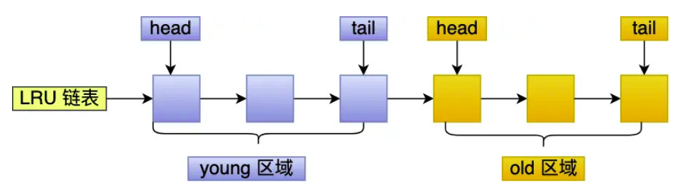

Redis缓存淘汰算法通过实现LFU算法来避免缓存污染而导致命中率下降的问题
MySQL和Linux则是通过改进的LRU算法来避免预读失效和缓存污染而导致的命中率下降的问题
## 传统LRU算法
传统的LRU算法：LRU算法一般用链表作为数据结构来实现，链表头部的数据是最近使用的，链表尾部的数据是最久没有使用的。当内存空间不足时，就淘汰链表尾部的数据。
### 预读机制
由于程序的局部性原理，靠近当前被访问的数据在未来很大概率会被访问到。因此操作系统会将多个page加载到内存。
## 预读失效
如果那些被提前加载的页，在后续过程中并没有被访问。而加载进来时却被放到了链表的头部，从而使尾部的数据被淘汰，而淘汰的可能是热点数据，这时就会大大降低缓存命中率。
### 如何降低预读失效的影响
核心：让预读页停留在内存的时间尽可能短，让真正被访问的页移动到LRU链表头部。从而保证热点数据尽可能的停留在内存中。
#### 具体做法
Linux：linux操作系统实现了两个LRU链表：活跃LRU链表(active list)和非活跃LRU链表(inactive list)
MySQL:在LRU链表上划分了2个区域：young区和old区。
设计思想都是讲数据分为冷数据和热数据，然后分别进行LRU算法

##### linux
* active list 活跃内存链表：存放最近被访问过的内存页
* inactive list 不活跃内存链表：存放很少被访问的内存页
预读页只需要加入到inactive list链表的头部，当真正被访问的时候，才讲页插入到active list的头部。这样预读数据即便没有被访问页不会干扰到active list中的热点数据
##### MySQL

划分两个区域后，预读的页只需加入到old区域的头部，只有在真正被访问的时候，才加入到young区域的头部。

## 缓存污染
即便如上改进了LRU算法，但当由大量页被读入，且被预读入的页只被访问一次时，依然可能会出现热点数据被淘汰出缓存。 这就是缓存污染问题。
当大量数据被读入，且读入数据都只被访问一次时，被访问数据会被插入到young区域头部或者active list头部，造成热点数据被淘汰
### 如何降低缓存污染
核心：提高数据进入active list或者young区域的门槛
##### linux
在内存页被访问第二次时，才将该页从inactive list提升到active list中
##### MySQL
在内存页被访问第二次时，不会马上将页提升到young区，还要根据该页在old区停留的时间进行判断
* 如果第二次访问时间与第一次访问时间再1s内，则不会讲其提升至young区
* 如果第二次访问和第一次访问间超过1s，则将该页从old区提升至young区

## Redis内存过期的淘汰策略
Redis内存淘汰策略共8种，大致分为不进行数据淘汰和进行数据淘汰
1. 不进行数据淘汰
    * noeviction：表示当前运行内存超过最大设置内存时，不进行任何数据淘汰，直接返回错误
2. 进行数据淘汰策略
    1. 在设置了过期时间的数据中进行淘汰
        * volatile-random:随机淘汰设置了过期时间的任意键值
        * volatile-ttl:优先淘汰更早过期的键值
        * volatile-lru(Redis3.0之前):淘汰了设置过期时间的键值中，最久未使用的键值
        * volatile-lfu(Redis4.0之后):淘汰设置了过期时间的键值中，最少使用的键值
    2. 在所有数据中进行淘汰
        * allkeys-random:随机淘汰任意键值
        * allkeys-lru：淘汰整个键值中最久未使用的键值
        * allkeys-lfu：淘汰整个键值中最少使用的键值
