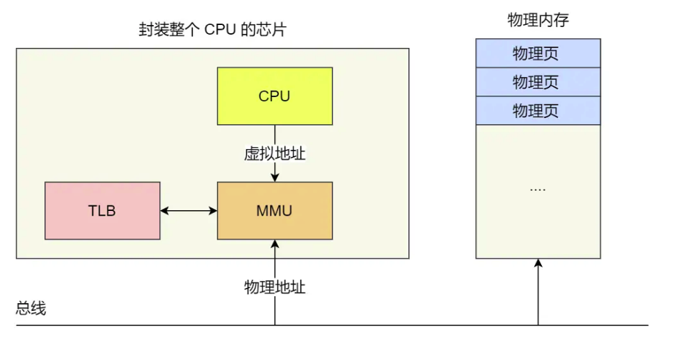

## 内存分段
程序在逻辑上被分为若干个段。代码段，数据段，栈段，堆段。不同的段有不同的属性，因此用分段的形式把这些段分离出来。
分段机制下的虚拟地址由两部分组成：**段选择因子和段内偏移量**

* 段选择子保存在段寄存器里面。段选择子里最重要的是段号，用作段表的索引。段表里保存的的是段的基地址，段的界限以及访问该段的权限。
* 段内偏移量应该为于0和段界限之间。

内存分段的缺点：
1. 产生内存碎片
2. 内存交换效率低下。因为每次需要把整个段给置换出去，而不同程序段的大小是不固定的，通常都比较大。
---
## 内存分页
分页是把整个虚拟空间和物理内存空间分成一段段固定大小。每一段称为页。

当进程访问的虚拟地址在页表中不存在时，将产生一个缺页异常。程序陷入内核，更新页表，为程序映射内存。

简单分页的缺点：由于每个进程都有自己的页表。而在4GB的内存空间中，页大小为4kb，则一个页表所消耗的内存为4MB。如果有多个进程，那么消耗量将会很大。

### 多级页表
根据程序的局部性原理。在一定时间尺度上，程序只会运行某一段指令，访问某一段内存区域。因此无需一次性讲某个程序的所有页表都加载到内存中。
如果某个一级页表的页表项没有用到，就不会常见对应二级页表。
***以下是关于64位多级页表的分析***

64位系统被分成了4级页表
* 全局页表目录项PGD
* 上层页目录项PUD
* 中间页目录项PMD
* 页表项PTE
### TLB
由于程序的局部性原理。科学家在CPU中专门封装了一个Cache(TLB)存放最近访问的页表项.通常称这个cache为页表缓存，快表等。

MMU先去访问TLB，如果TLB中没找到才会去访问内存中的页表，并更新TLB。

---
## malloc内存分配
