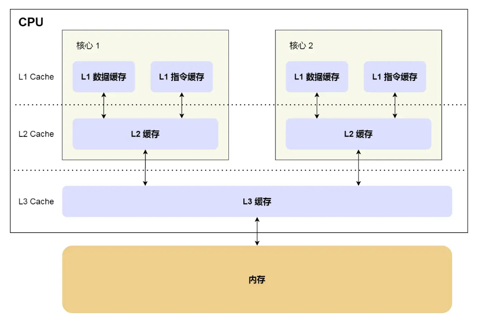
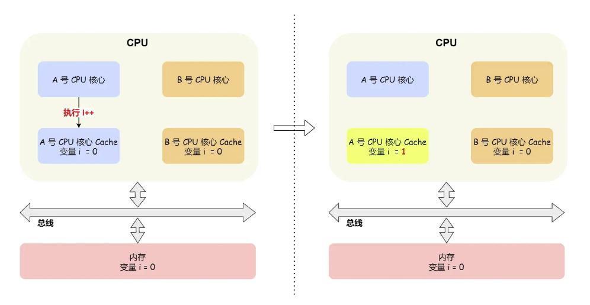

## 冯诺依曼
冯诺依曼结构计算机：数据计算与数据存储分离，他们之间通过数据总线连接。
### 中央处理器
* 32位CPU一次可以计算4个字节
* 64位CPU一次可计算8个字节

常见寄存器：
* 通用寄存器：用来存放需要进行运算的数据，如需要进行加法运算的两个数据
* 程序计数器：用来存储CPU要执行的下一条指令的内存地址。
* 指令寄存器：用来存放当前正在执行的指令，即指令本身。

### 总线
总线根据功能分为3种：
* 地址总线：用于指定CPU将要操作的内存地址
* 数据总线：用于读写数据
* 控制总线：用于发送和接收信号。比如读写命令，中断信号，设备复位信号等

## 如何让cpu跑的更快
主要围绕程序时间的局部性和空间的局部性。
时间局部性：如果程序中的一条指令一旦执行，则不久之后该指令可能再次被执行。如果某个数据被访问，则在之后不久可能再次被访问
空间的局部性：一旦程序访问某个存储单元，在不久之后，其附近的存储单元也将会被访问

因此在硬件结构设计时需要尽可能的实现能快速寻找到局部的指令和数据。
1. 三级缓存

* l1 cache通常被分为「数据缓存」和「指令缓存」
* L1 cache和l2 cache都是每个cpu核独有的，而l3 cache是多个cpu核心共享的

每次从内存中读取一个cache line。 而一个cache line 包含多个字

软件上如何优化：
程序代码时存储在硬件上的，因此在程序的指令和数据上应尽可能的实现cache命中。
1. 在访问内存时，应注意尽量顺序访问，不要跳跃式访问(这样会造成cache 频繁刷新，降低命中率)
2. cpu有分支预测器。所以我们应该尽可能的保证数据的存储访问具有一定的规律性。这样能更好的发挥cpu的预读功能。例如对数组应该先排序后遍历。
3. 在多cpu核的系统中，为提升l1 和 l2的命中率，应该对线程进行绑核处理

## 缓存一致性问题
在多cpu核心硬件中，由于cpu的执行结果只写到了l1和l2的cache种，因此当其他cpu核心从内存中读取相同数据时将会得到老的数据

为了解决缓存一致性问题，需要保证以下几点
1. 某个cpu核心的cache数据更新时，必须要传播到其他核心的cache，这个称为「写传播」
2. 某个cpu核心里对数据的操作顺序，必须在其他核心看起来顺序是一样的，这个称为事务的串行化。
    * 事务串行化必须做到如下两点
    1. cpu核心对cache种数据的操作，需要同步给其他cpu核心
    2. 要引入锁的概念，如果两个cpu核心中有相同的数据的cache，那么对于这个cache数据的更新，只有拿到锁，才能进行

