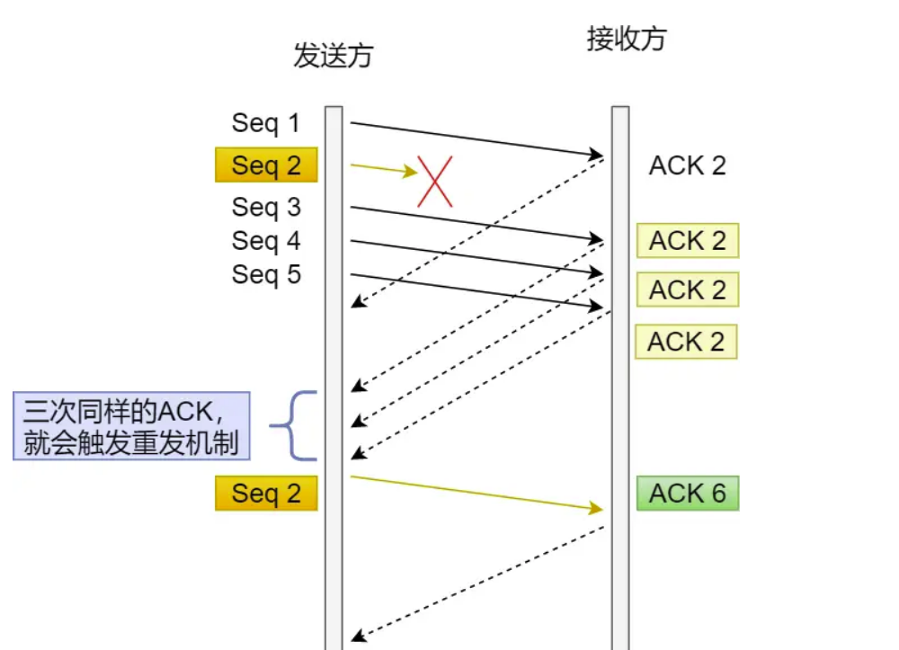
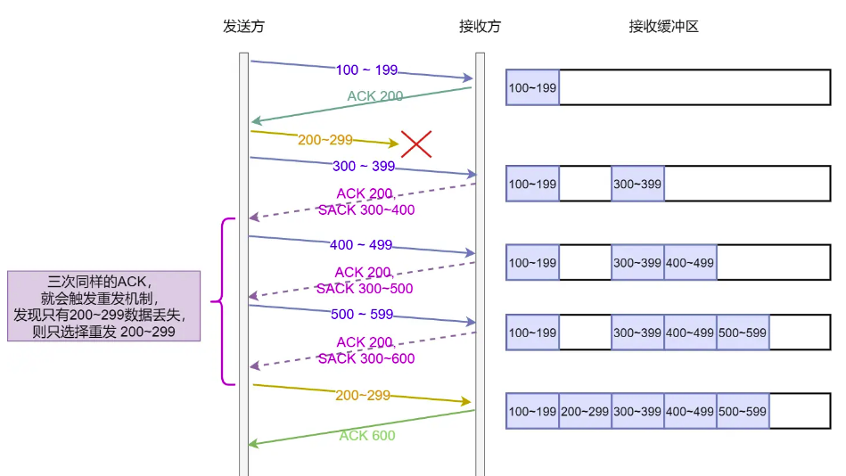
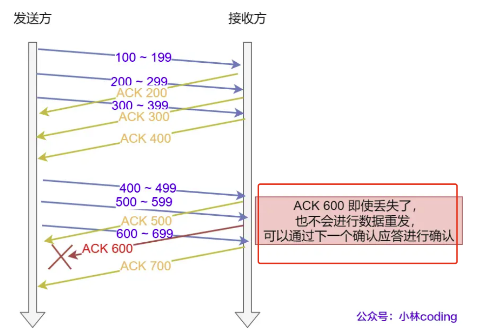
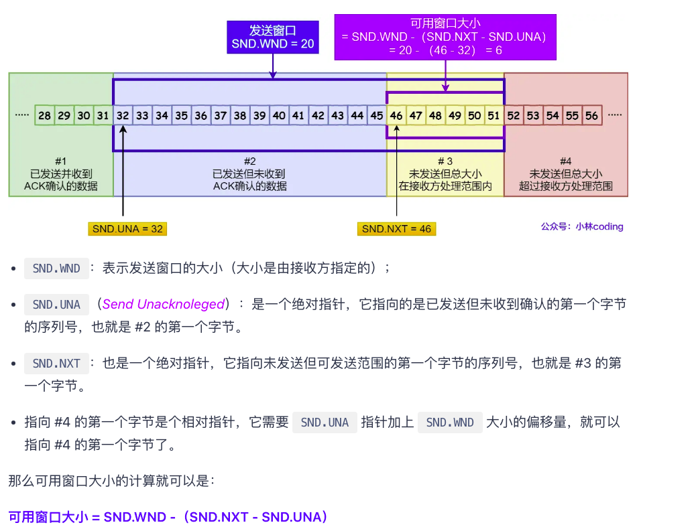
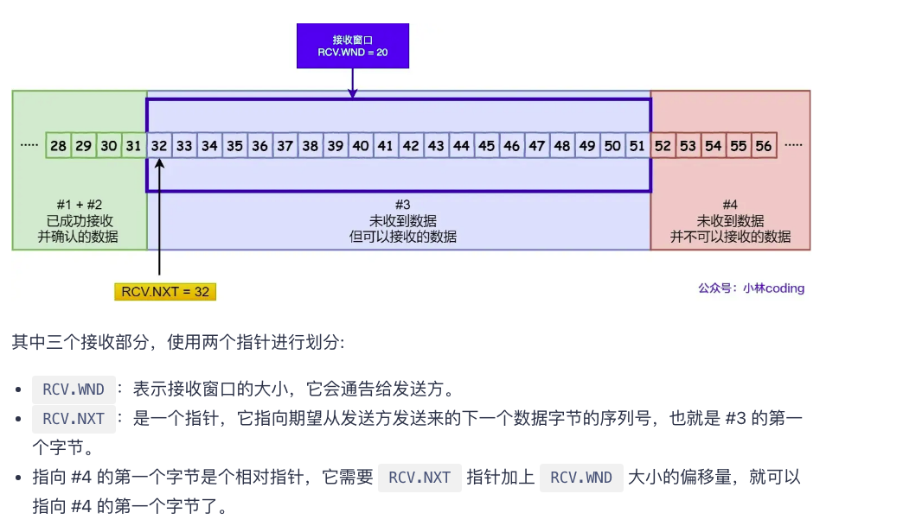
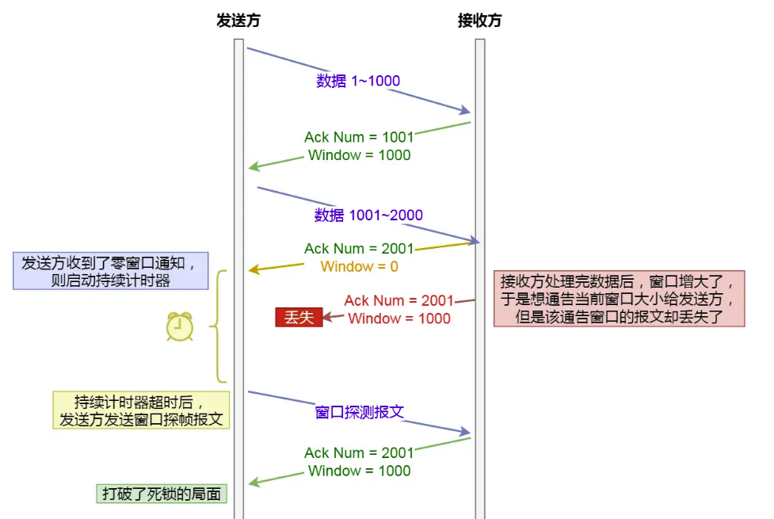

## 重传机制
* 超时重传
* 快速重传
* sack方法
* Duplicate SACK

### 超时重传
数据在发送时，设置了一个定时器，才超过指定时间内，没有得到接收方的ACK确认应答就会重新发送数据，这就是超时重传
RTT:数据发送时刻接收到确认的时刻差值，也就是包的往返时间
所以超时重传的时间RT0应该略大于RTT
### 快速重传
快速重传不以时间为驱动，而是以数据为驱动进行重传。<font color=blue>当发送方连续收到三次相同编号的ACK时，即便没有达到RT0时间仍旧重传</font>
**缺点**：发送方不知道接收方到底丢失了几个报文。假设有两个报文丢失，如果每个报文都连发三次ack，那么效率将会很低

### SACK
SACK: 选择性确认。这种方法是在TCP头部的选项字段里面加一个SACK的东西，可以讲已收到的数据的信息发送个发送方，这样发送方就只重传丢失的数据。



## 滑动窗口
滑动窗口的提出：如果发送方每发送一个数据都需要等到ACK确认消息后才能发下一个，这样的话受网络状态的影响较大，通信效率较低。因此为了解决这个问题，引入了滑动窗口的概念。有了窗口，可以指定窗口的大小，窗口大小是指<font color=blue>无需等待确认应答，而可以继续发送数据的最大值</font>

窗口的实现实际上是操作系统开辟了一个缓存空间，发送方在等待确认应答返回之前，必须在缓冲区保留已发送的数据，如果按期收到确认应答，此时数据就可以从缓存区清除。


通常窗口的大小是由接收方的窗口大小决定的。发送方的数据大小不能超过接收方的窗口大小，否则无法正常接收数据

窗口的大小由接收方的窗口大小来决定。TCP头里有一个字段叫window，也就是窗口大小。这个字段是接收端高速发送端自己还有多少缓冲区可以接收数据，于是发送端就可以根据这个接收端的处理能力来发送数据，而不会导致接收端处理不过来。
发送方：

接收方

## 流量控制

### 操作系统缓冲区与活动窗口的关系
发送窗口和接收窗口中所存放的字节数，都是放在操作系统内存缓冲区的，而操作系统的缓冲区，会被操作系统调整
因此可能出现如下情况
1. 由于上层应用处理信息不及时，消息积压在缓冲区，造成滑动窗口可用空间不断减少，直到为0.从而发送端不再发送消息
2. 由于接收端整个系统的资源紧张，导致系统缩小缓冲区大小(从而造成滑动窗口减小)。但接收端通知发送端需要一定时间，因此在该时间段内，发送端仍按照之前商量的窗口大小发送数据，可能造成接收端消息溢出而被丢弃。

<font color=red>为了防止上述情况二的发生，TCP规定不允许同时减少缓存又收缩窗口。而是采用先收缩窗口，过一段时间减少缓存，这样可以避免丢包情况</font>

### 窗口关闭问题
假设因为接收方未及时处理消息导致最终窗口可用大小为0，此时发送方将不再发送消息，等待接收方处理消息后给出窗口大小不为0的ACK信号之后再发送消息。<font color=red>但如果该ACK消息在网络中丢失了，此时就会形成死锁</font>
解决方法：当窗口大小为0时，发送方启动定时器，定期发送「窗口探测报文」，对方在收到报文时给出自己现在的接收窗口大小

* 如果接收窗口仍然为 0，那么收到这个报文的一方就会重新启动持续计时器
* 如果接收窗口不是 0，那么死锁的局面就可以被打破了

### 糊涂窗口综合症
如果接收窗口一有几个可用字节就通知发送方，那么将会造成极大的资源浪费(TCP+IP的头有40个字节，为了几个字节多发送40个字节太不划算)。
**接收方不告知小窗口**
当窗口大小小于 min(MSS, 缓存空间/2)，就会向发送方通告窗口大小为0，从而阻止发送方再发送数据过来
因此要等到如下条件中其中一个成立才发送
**发送方避免发送小数据**
发送方使用Nagle算法，满足如下条件中的一个才发送数据
1. 等到窗口大小 >=MSS 且数据大小 >=MSS
2. 收到之前发送数据的ack回包
```
if 有数据要发送 {
    if 可用窗口大小 >= MSS and 可发送的数据 >= MSS {
    	立刻发送MSS大小的数据
    } else {
        if 有未确认的数据 {
            将数据放入缓存等待接收ACK
        } else {
            立刻发送数据
        }
    }
}
```
## 拥塞控制
流量控制是在网络两端对数据的发送速率进行控制，而拥塞控制是根据当前整个网络的繁忙状态对数据的发送速率进行控制。