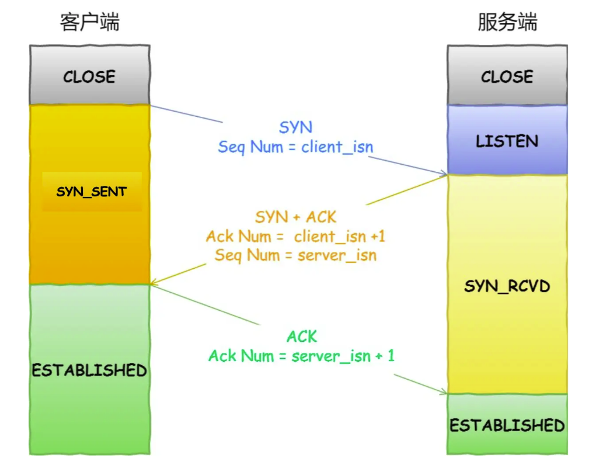
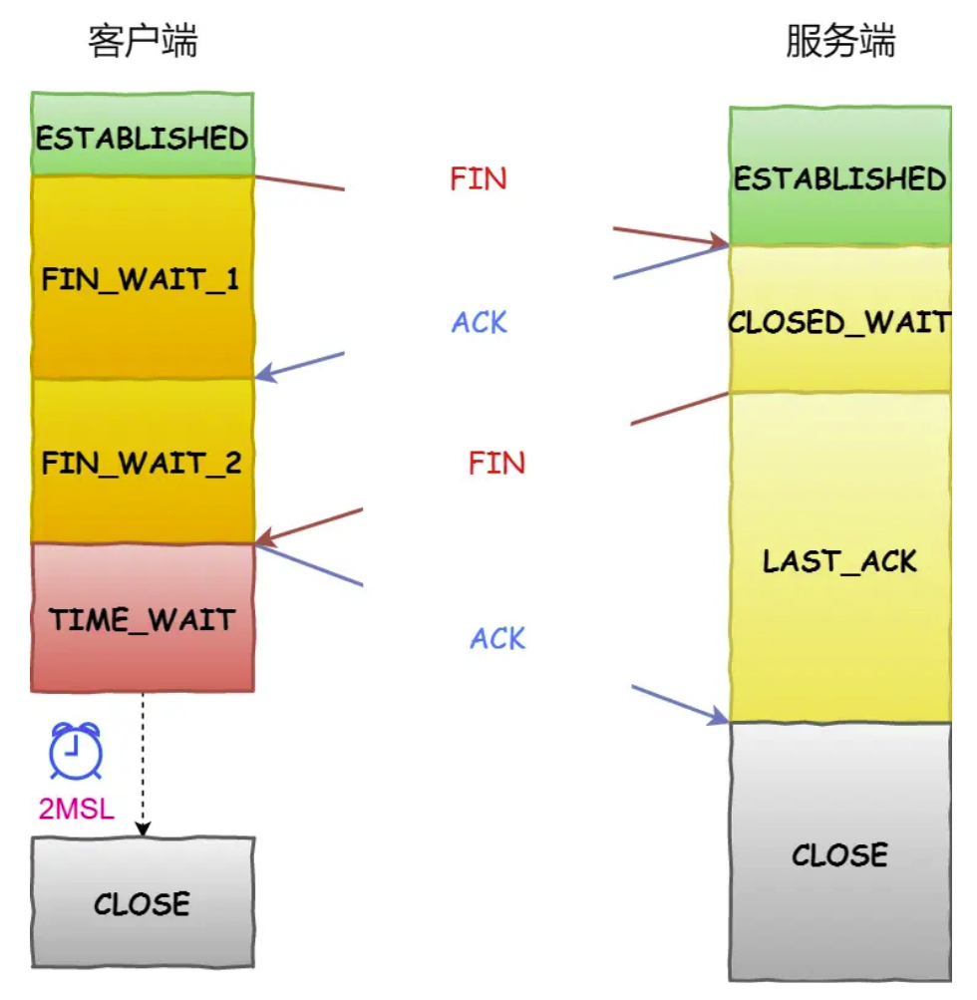
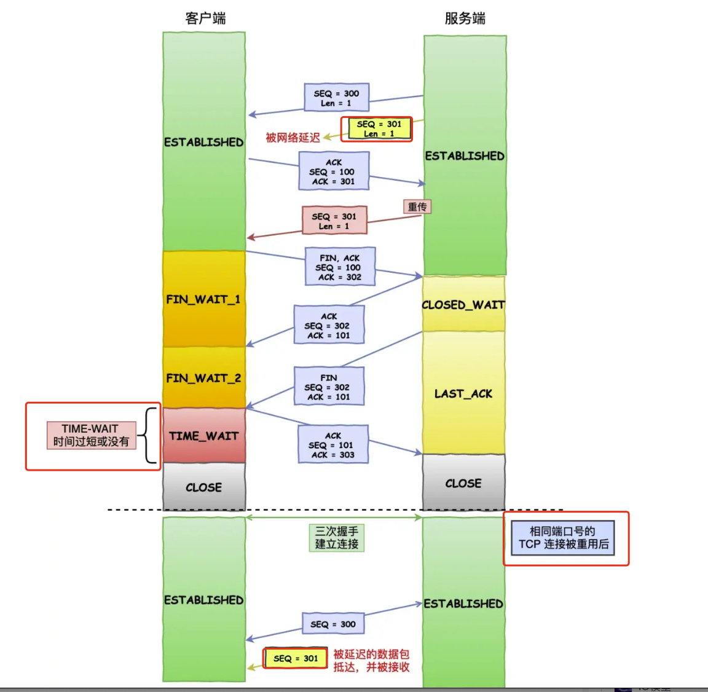
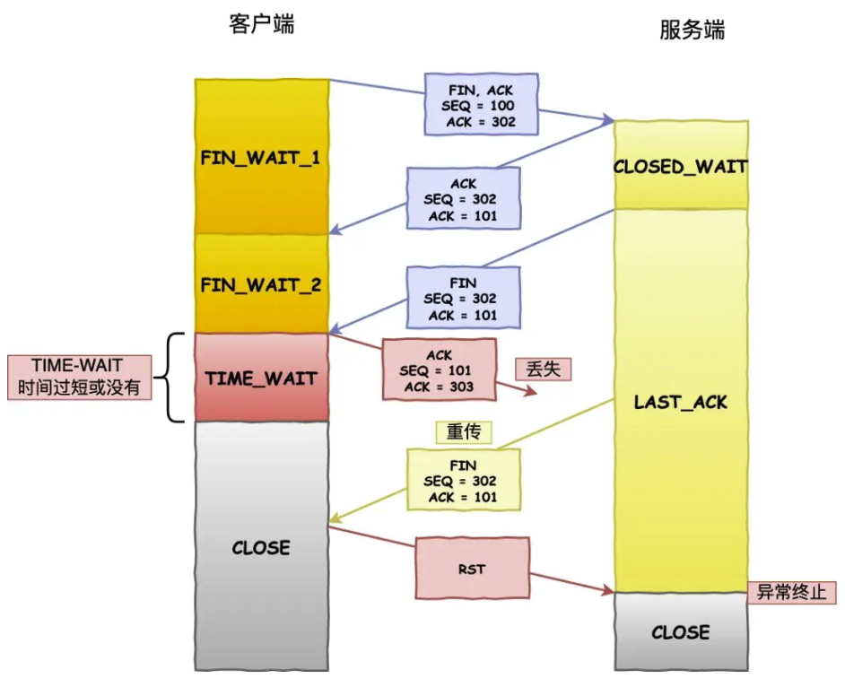

## TCP
### 三次握手

为什么是三次握手，不是两次，四次？
核心：为什么三次握手可以初始化Socket，序列号和窗口大小并建立TCP链接
从以下三个方面分析：
1. 三次握手才可以阻止重复历史连接的初始化(主要原因)
2. 三次握手才可以同步双方的初始化序列号
3. 三次握手才可以避免资源浪费

原因一：避免历史连接

### 四次挥手

为什么四次挥手需要有TIME-WAIT状态，主要原因有两点
1. 防止历史连接中的数据被后面相同的四元组的连接错误的接收
2. 保证被动关闭连接的一方能正确关闭

**原因一：防止历史连接的数据，被后面相同的四元组的连接  错误的接收**
关于序列号seq和初始序列号isn
* seq，是TCP的头部字段，「标识了一个TCP发送端到TCP接收端的数据流的一个字节」，TCP是面向字节流的可靠协议，为了保证消息的顺序性和可靠性。以便在传输成功后确认，丢失消息后重传以及在接收端保证不会乱序。序列号是一个32位的无符号数，在到达4G之后再循环到0
* isn初始序列号，它给予时钟生成一个随机数，保证每个链接都拥有不同的初始序列号。初始化序列号可被视为一个32位的计数器，该计数器的数值每4微妙+1，循环一次需要4.5小时

**序列号和初始化序列号并不是无限递增的，会发生绕回的情况，因此无法根据序列号来判断新老数据**

如上图所示如果没有TIME_WAIT阶段或者该阶段太短，一定概率上下一次的连接可以收到上一次连接遗留下来的数据流，从而造成数据错乱的严重问题。

**原因二：保证被动关闭连接的一方能正确的关闭**
最后一次ACK消息丢失后，被动关闭的一方会重新发送FIN报文，但因为没有TMIE-WAIT或者TIME-WAIT太短。导致只能收到对端发挥的RST(将被解释为错误)信息。从而可能导致被动关闭的一方进入异常处理阶段，不是一个优雅的关闭

#### 优化TIME-WAIT方法
1. 打开net.ipv4.tcp_tw_reuse 和 net.ipv4.tcp_timestamps 选项.「内核会随机找一个time_wait状态超时1s的连接重新复用」
2. net.ipv4.tcp_max_tw_buckets
3. 程序中使用 SO_LINGER ，应用强制使用 RST 关闭。「该方法强行跳过了TIME-WAIT阶段，不建议使用」